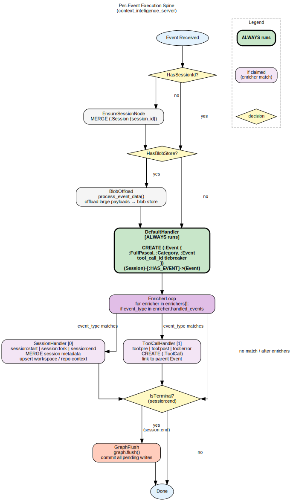
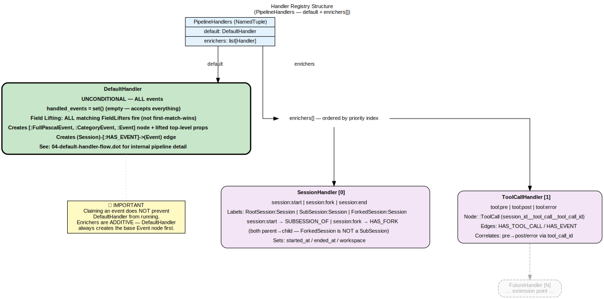
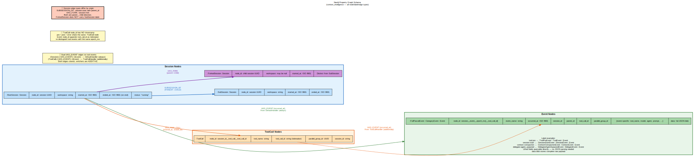
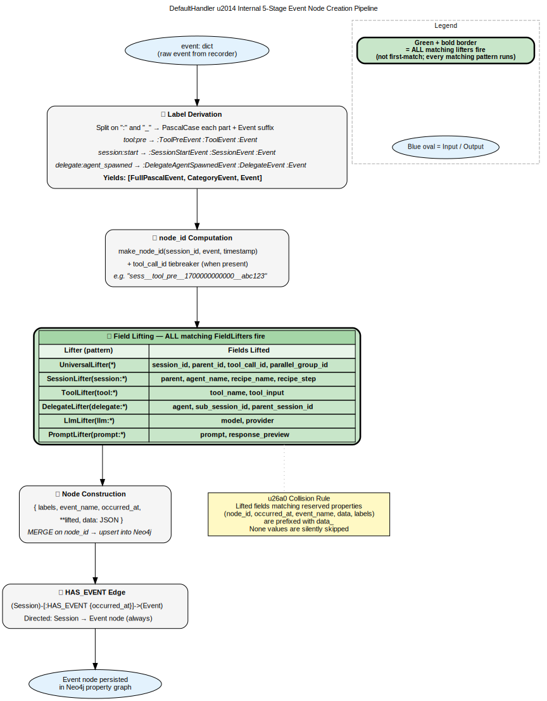

# Architecture Diagrams

This file is the entry point for all architecture documentation and the consumer for SVG
regenerations. SVG files exist only to be embedded in this README — they are never
standalone artifacts.

---

> **Note:** SVGs are generated build artifacts and are not tracked in git. Images below will
> appear broken until you run the regeneration command in the
> [Regenerating SVGs](#regenerating-svgs) section at the bottom of this file.

## Pipeline Flow



**Source:** [`01-pipeline-flow.dot`](./01-pipeline-flow.dot)

End-to-end flow of an ingested event through the context-intelligence pipeline: from the
HTTP endpoint through the `EventPipeline`, dispatcher, handler registry, and into the
graph store.

---

## Handler Architecture



**Source:** [`02-handler-architecture.dot`](./02-handler-architecture.dot)

Class-level view of the handler layer. Shows the `BaseHandler` protocol, the registry,
and every concrete handler (`SessionHandler`, `ToolCallHandler`, `DefaultHandler`, etc.)
with their data-layer variant relationships.

---

## Graph Model



**Source:** [`03-graph-model.dot`](./03-graph-model.dot)

Property-graph schema stored in Neo4j. Nodes (`Session`, `Event`, `ToolCall`, `Blob`)
and their typed relationships (`HAS_EVENT`, `EMITTED`, `REFERENCES_BLOB`).

---

## DefaultHandler Flow



**Source:** [`04-default-handler-flow.dot`](./04-default-handler-flow.dot)

Internal decision flow of `DefaultHandler.handle()`: field lifting, blob extraction,
threshold checks, and the conditional path to graph upsert vs. pass-through.

---

## Regenerating SVGs

SVG files are generated from the `.dot` source files in this directory. To regenerate
all SVGs after editing a `.dot` file, run the following from the project root:

```sh
for f in docs/architecture/*.dot; do dot -Tsvg "$f" -o "${f%.dot}.svg"; done
```

> **Note:** SVG files exist only to be embedded in this README. Do not reference them
> directly from other documents — update the `.dot` sources and regenerate instead.
