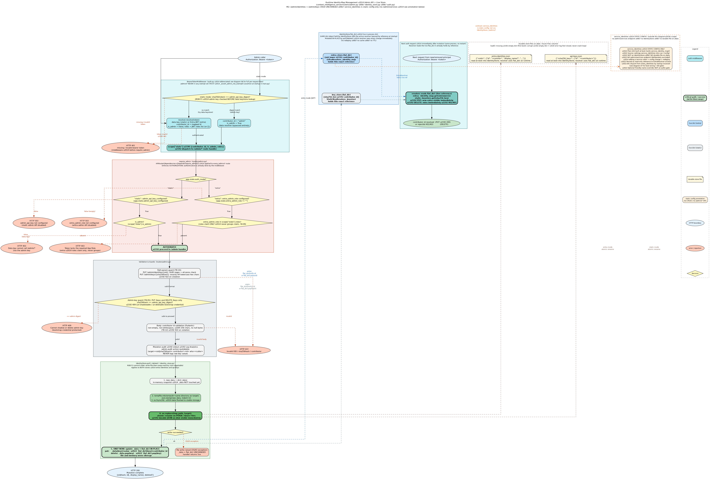

# Architecture Diagrams

This file is the entry point for all architecture documentation and the consumer for the
rendered diagrams. PNG files are rendered from the `.dot` sources in this directory and are
the tracked artifact — they exist to be embedded in this README.

---

> **Note:** PNGs are rendered from the `.dot` sources and committed alongside them. After
> editing a `.dot` file, re-render with the command in the
> [Regenerating PNGs](#regenerating-pngs) section at the bottom of this file.

## Auth Middleware Position in the Stack

`BearerTokenMiddleware` sits as ASGI middleware **upstream of all HTTP routes** — it wraps
the FastAPI application and intercepts every HTTP request before routing begins. The
middleware validates the `Authorization: Bearer <token>` header, resolves the token to a
contributor id via the active `PrincipalResolver`, and injects `contributor_id` into
`scope["state"]` for downstream handlers; it short-circuits with `401` or `403` on any auth
failure before the FastAPI route handler is ever invoked. Several paths are always exempt
(health checks, monitoring, web-UI pages — the exact set depends on `web_ui_enabled`); see
diagram 06 for the complete per-request decision flow and diagram 07 for how the resolver
and exempt-path set are selected at boot time.

---

## Diagrams

| # | File | What it shows |
|---|------|---------------|
| 01 | [01-pipeline-flow.dot](./01-pipeline-flow.dot) | Per-event processing spine within the drainer |
| 02 | [02-handler-architecture.dot](./02-handler-architecture.dot) | Handler class-level architecture |
| 03 | [03-graph-model.dot](./03-graph-model.dot) | Neo4j property-graph schema |
| 04 | [04-default-handler-flow.dot](./04-default-handler-flow.dot) | DefaultHandler internal decision flow |
| 05 | [05-durable-ingest-queue.dot](./05-durable-ingest-queue.dot) | Durable ingest queue + drain loop (incl. auth middleware entry) |
| 06 | [06-auth-flow.dot](./06-auth-flow.dot) | **Per-request auth flow** — BearerTokenMiddleware → resolver dispatch → `/admin/*` branch or `post_events` |
| 07 | [07-auth-startup.dot](./07-auth-startup.dot) | **Auth boot wiring** — mode selection, JWKS prefetch, fail-closed gate, exempt-path selection |
| 08 | [08-identity-map-management.dot](./08-identity-map-management.dot) | **Runtime identity-map management** — admin API, `require_admin` gate, `IdentityStore` write-then-swap, live `flat_dict`, no-redeploy proof |

---

## Auth Flow (per-request)


**Source:** [`06-auth-flow.dot`](./06-auth-flow.dot)

The complete per-request authentication decision flow — updated in **M2** to add a dual-path
`EntraResolver` (user + service) and per-route capability checks. Every HTTP request enters
`BearerTokenMiddleware`, which checks whether the path is exempt, extracts the bearer token,
and dispatches to the active `PrincipalResolver`. After identity and roles are injected into
scope state, a **path dispatch** routes requests to the admin handler (diagram 08) or to a
per-route capability gate before the data route handler.

- **`StaticKeyResolver` (auth_mode=static):** `sha256(token)` → keystore lookup → contributor
  id or `None` → 401.
- **`EntraResolver` (auth_mode=entra) — M2 dual-path:** JWKS signing-key fetch → `jwt.decode`
  (RS256, dual audience `[client_id, api://client_id]`, issuer, `exp`/`iss`/`aud` required)
  → `tid` check → **B1 `idtyp`-first decision** (gate placed _before_ `ScpCheck`):
  - **USER path** (`scp` present AND `idtyp != "app"`) — Option A, unchanged: `scp` contains
    `access_as_user` → `oid` validated → `identity_map[oid.lower()]` → contributor id;
    unmapped oid → `AuthError(403)`. Delegated-user behavior is byte-for-byte identical to M1.
  - **SERVICE path** (`idtyp == "app"` AND `scp` absent — M2 new): **role gate is the sole
    authz gate** — admit iff `roles` contains `Contributor` (write + read), `Reader`
    (read only), or `IdentityAdmin` (admin); no role → `AuthError(403)` whose message names
    the missing role (`"app <appid> has no Contributor/Reader role on this API — assign
    one"`). `created_by` is derived from **stable Azure-assigned claims only**: trusted
    `service_identities[oid]` map (optional friendly-name override, _not_ an authorization
    gate) → `appid`/`azp` → `oid` (truthiness chain, never key-presence); **`app_displayname`
    is never used** (caller-spoofable, often absent on v2.0/MI tokens); fail-loud 403 if all
    stable claims are absent (B8). There is no "unmapped → 403" on the service path — the map
    is optional; an unmapped SP gets a stable GUID until an admin adds a friendly override.
  - **Ambiguous token** (both `scp` + `idtyp=="app"`, or neither) → `AuthError(401)`,
    fail-closed (B1 mutual-exclusion, prevents namespace bleed).
  - **(B2)** `idtyp` is normalized before comparison: non-string → `""`, lower/strip.
  - All failures raise `AuthError(401/403)`, logged at INFO with `auth_event=auth_denied`;
    unexpected resolver exceptions are caught, logged at ERROR, and fail-closed as `401`.

- **Per-route authorization (D2 — M2 new):** downstream of identity injection, two
  capability gates are applied via FastAPI `Depends()` before the route handler:
  - `require_write` (`POST /events`): write-capable iff mapped contributor AND
    `roles ∋ Contributor`, or service path with `roles ∋ Contributor`. A `None`
    contributor on a write route is hard-403 (B3 — never stamps `created_by=None`).
  - `require_read` (`POST /cypher`, `GET /blobs/*`): read-capable iff write-capable OR
    `roles ∋ Reader`. Reader → write route = 403 with named capability message.
  - `/admin/*` is unchanged: `require_admin` checks `IdentityAdmin` role (entra) or
    `is_admin` flag (static).

On success, `contributor_id` and `roles` are both injected into `scope["state"]`. The
`post_events` handler validates `data.timestamp` (→ 400 on missing/invalid), checks
idempotency, stamps `body["created_by"] = contributor_id` (write-once, prevents client
spoofing), and appends the stamped body to the durable queue (→ 202).

> **Authorization ownership note (D7):** "who can write" for service tokens is now determined
> by Entra app-role assignments (`Contributor`/`IdentityAdmin` on the API SP), not a local
> allow-list. This is an intentional, auditable admin act — but it means periodic review of
> Contributor/IdentityAdmin holders in Entra is a named operational responsibility.

---

## Auth Startup Wiring


**Source:** [`07-auth-startup.dot`](./07-auth-startup.dot)

How authentication is wired at boot inside `create_asgi_app()`. The function branches on
`auth_mode`:

- **`static`:** builds `StaticKeyResolver(build_keystore())` — pure dict, no network.
- **`entra` (M2 updated):** builds both identity maps from config, checks the B4
  disjointness invariant, eagerly fetches JWKS, and constructs `EntraResolver` with five
  parameters. Specifically:
  1. **`build_identity_map()`** — `{oid_lower → contributor_id}` from `entra_identities`
     config; passed as the **live** `IdentityStore.flat_dict` (runtime-mutable by
     `/admin/identities` — see diagram 08).
  2. **`build_service_identity_map()`** — `{oid_lower → friendly_name}` from
     `service_identities` config; a **plain dict** (NOT an `IdentityStore`, NO durable
     file). Static config only — managed by config change + redeploy, never by an admin
     API.
  3. **B4 disjointness invariant** (fail-closed gate before JWKS fetch): if
     `entra_identities.keys() ∩ service_identities.keys() ≠ ∅` the server raises
     `RuntimeError` and refuses to start. Note: B1 (`idtyp`-first branching) is the
     security-critical human/service separation; B4 guards friendly-name collision hygiene.
  4. **JWKS prefetch** — `PyJWKClient.fetch_data()` eagerly; fail-closed if the endpoint
     is unreachable or returns zero keys (`RuntimeError`, server refuses to start).
  5. **`EntraResolver(client_id, tenant_id, identity_map, service_identity_map,
     service_data_role, reader_role, entra_admin_role)`** — constructed after both maps
     are built and B4 + JWKS gates pass.

A fail-closed gate then rejects boot if `resolver.auth_enabled` is `False` and
`allow_unauthenticated` is not set (the latter is a test/dev-only opt-out, never for
production). The exempt-path set is selected based on `web_ui_enabled`: the full set
includes `/logs/stream`, `/`, `/dashboard`, `/docs`, `/openapi.json`; the API-only set
reduces to `/status` and `/version` so web-UI paths cannot be reached unauthenticated.
Finally, `BearerTokenMiddleware(app, resolver, exempt_paths)` is assembled and returned as
`asgi_app` (served by Gunicorn + uvicorn).

---

## Runtime Identity-Map Management



**Source:** [`08-identity-map-management.dot`](./08-identity-map-management.dot)

End-to-end flow for runtime identity-map management via the `/admin/*` API — no server restart
required for any mutation. The diagram covers both the **entra-identities store** (oid →
contributor) and the **api-keys store** (sha256 hash → contributor) through a single shared
`IdentityStore` abstraction.

> **M2 scope note:** this diagram's admin API is **unchanged** from M1. The M2 dual-path adds
> a `service_identities` map for service/app tokens, but **there is no `/admin/services`
> endpoint** — that was deliberately excluded. `service_identities` is **static config only**:
> a plain dict built from settings at boot via `build_service_identity_map()`, with no durable
> file on `/data` and no runtime CRUD. Adding or removing a service caller requires a config
> change and redeploy. The diagram annotates this explicitly (orange dashed cluster) to prevent
> readers from assuming services are runtime-manageable. See diagram 07 for how the service
> map is wired at boot alongside the B4 disjointness gate.

**Authorization gate (`require_admin`):** applied router-wide via
`APIRouter(dependencies=[Depends(require_admin)])`. The middleware (`BearerTokenMiddleware`)
handles authentication first — `/admin/*` paths are never exempt (TB-07 startup assertion).
`require_admin` then enforces *authorization*:

- **Static mode:** `admin_api_key_configured` on `app.state` → 503 if unconfigured; `is_admin`
  flag in scope state → 403 if False (data key used). The admin key is recognized by the
  middleware before the data keystore is consulted (ROB F1); it resolves to
  `contributor_id="admin"`, `is_admin=True`.
- **Entra mode:** `entra_admin_role` on `app.state` → 503 if empty; `IdentityAdmin` (or the
  configured role) in the token's `roles` claim → 403 if absent. Only the `roles` claim is
  checked — `groups` can never grant admin access (TB-09).

**Validation and guards:** path-param guard (GUID regex + all-zeros check for OIDs; 64-hex
check for key hashes) → 422; admin-key guard (hash of `admin_api_key` cannot be shadowed or
deleted via the API) → 409; contributor-id body validation (non-empty, ≤256 chars, no null
bytes, TB-12) → 422; structured audit line to stdout → Log Analytics before every successful
mutation (raw keys are never logged).

**`IdentityStore` commit order (ROB F2 — non-negotiable):** `put` / `delete` build a snapshot
of the current data dict, write it to a tempfile in the same directory, `fsync`, then
`os.replace` (atomic on POSIX and Azure Files) onto the target. Only after the file write
succeeds are `_data` and `flat_dict` updated in-place. A write failure leaves memory
unchanged; the handler returns 5xx. The persistent JSON file and in-process dict are never
out of sync.

**Live in-process dict (no-redeploy proof):** `IdentityStore.flat_dict` is the same dict
object passed by reference to the active resolver at startup
(`StaticKeyResolver(key_store.flat_dict)` / `EntraResolver(…, entra_store.flat_dict, …)`).
After `StUpdateMem`, the resolver's keystore/identity-map is already updated — the very next
authenticated request resolves the new principal immediately after a `PUT`, or is rejected
immediately after a `DELETE` (no cache, no TTL, no restart).

**Load-time fail-closed:** on `IdentityStore.load()`, a missing file → empty dict (normal
first boot); a corrupt / partial / invalid-JSON file → empty dict + loud `logger.error` /
`logger.critical` — the server never crash-loops on a bad store file, but every auth attempt
fails until an admin re-populates via the `/admin` API.

---

## Durable Ingest Queue & Drain Loop


**Source:** [`05-durable-ingest-queue.dot`](./05-durable-ingest-queue.dot)

The headline of the durable-ingest work and the most important view of the system today.
Requests enter via `BearerTokenMiddleware` (auth gate — see diagram 06) and are rejected
with `401`/`403` before reaching the route handler if credentials are missing or invalid.
`POST /events` then validates `data.timestamp` (→ 400 on failure), stamps `created_by`
from the verified contributor id, persists the event to a durable per-session append-log,
and returns `202` immediately (persist-then-202); an async single drainer per session
processes batches and flushes them to Neo4j under a global write semaphore, retrying
transient/deadlock failures and isolating poison events to a dead-letter file. Durable files
per session are `<worker_key>.log` (append-only raw events — `created_by`-stamped),
`<worker_key>.offset` (last committed byte position), and `<worker_key>.dead.jsonl` (poison
records). On startup the server replays unprocessed log lines and re-seeds counters from
disk (crash recovery). Live conservation metrics surface on `/status`, and authenticated
`/queues/dead-letter` endpoints support inspect, replay, and purge.

---

## Pipeline Flow


**Source:** [`01-pipeline-flow.dot`](./01-pipeline-flow.dot)

The per-event processing spine **within the drainer** — invoked by `registry.drain_worker`,
not by the HTTP request directly. Shows how a single dequeued event moves through the
`EventPipeline`, dispatcher, handler registry, and into the graph store. See diagram
[05](#durable-ingest-queue--drain-loop) for where this spine sits in the persist-then-202
ingest/drain flow.

---

## Handler Architecture


**Source:** [`02-handler-architecture.dot`](./02-handler-architecture.dot)

Class-level view of the handler layer. Shows the `BaseHandler` protocol, the registry,
and every concrete handler (`SessionHandler`, `ToolCallHandler`, `DefaultHandler`, etc.)
with their data-layer variant relationships.

---

## Graph Model


**Source:** [`03-graph-model.dot`](./03-graph-model.dot)

Property-graph schema stored in Neo4j. Nodes (`Session`, `Event`, `ToolCall`, `Blob`)
and their typed relationships (`HAS_EVENT`, `EMITTED`, `REFERENCES_BLOB`).

---

## DefaultHandler Flow


**Source:** [`04-default-handler-flow.dot`](./04-default-handler-flow.dot)

Internal decision flow of `DefaultHandler.handle()`: field lifting, blob extraction,
threshold checks, and the conditional path to graph upsert vs. pass-through.

---

## Regenerating PNGs

PNG files are rendered from the `.dot` source files in this directory and are the tracked
artifact. To re-render a single diagram after editing its `.dot` source:

```sh
dot -Tpng -o NAME.png NAME.dot
```

To re-render all diagrams after editing any `.dot` file, run the following from the project root:

```sh
for f in docs/architecture/*.dot; do dot -Tpng "$f" -o "${f%.dot}.png"; done
```

> **Note:** PNG files exist only to be embedded in this README. Do not reference them
> directly from other documents — update the `.dot` sources and re-render instead.
