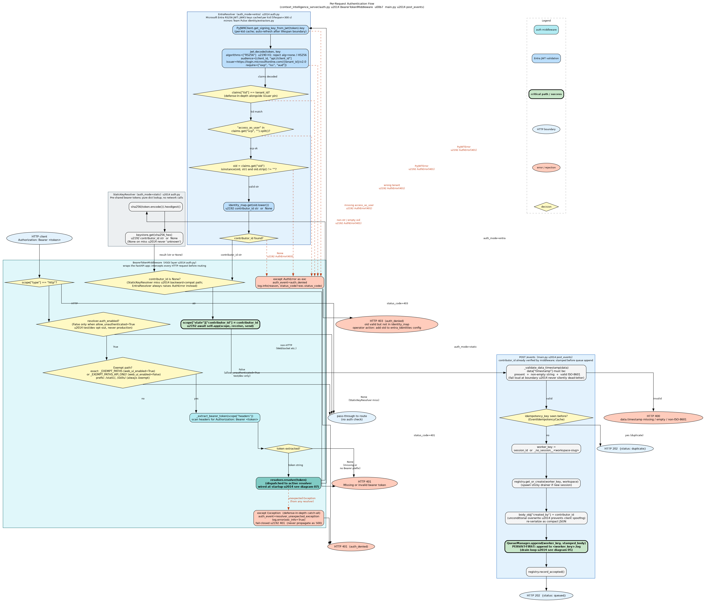
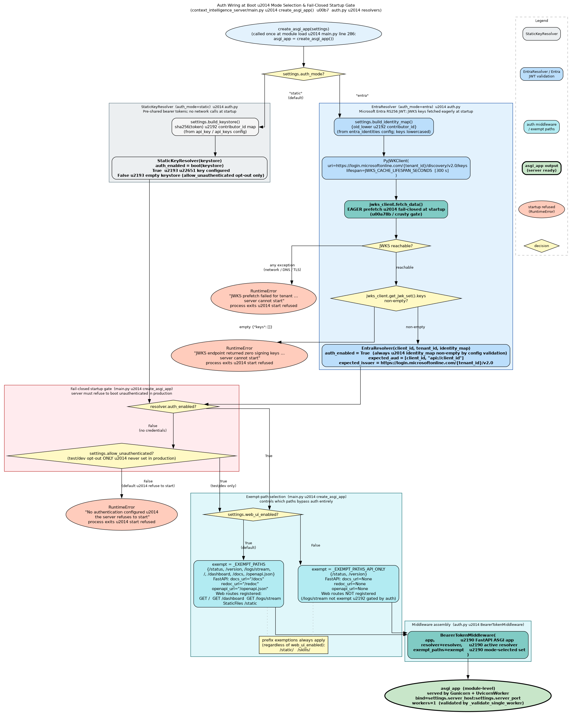

# Architecture Diagrams

This file is the entry point for all architecture documentation and the consumer for the
rendered diagrams. PNG files are rendered from the `.dot` sources in this directory and are
the tracked artifact — they exist to be embedded in this README.

---

> **Note:** PNGs are rendered from the `.dot` sources and committed alongside them. After
> editing a `.dot` file, re-render with the command in the
> [Regenerating PNGs](#regenerating-pngs) section at the bottom of this file.

## Auth Middleware Position in the Stack

`BearerTokenMiddleware` sits as ASGI middleware **upstream of all HTTP routes** — it wraps
the FastAPI application and intercepts every HTTP request before routing begins. The
middleware validates the `Authorization: Bearer <token>` header, resolves the token to a
contributor id via the active `PrincipalResolver`, and injects `contributor_id` into
`scope["state"]` for downstream handlers; it short-circuits with `401` or `403` on any auth
failure before the FastAPI route handler is ever invoked. Several paths are always exempt
(health checks, monitoring, web-UI pages — the exact set depends on `web_ui_enabled`); see
diagram 06 for the complete per-request decision flow and diagram 07 for how the resolver
and exempt-path set are selected at boot time.

---

## Diagrams

| # | File | What it shows |
|---|------|---------------|
| 01 | [01-pipeline-flow.dot](./01-pipeline-flow.dot) | Per-event processing spine within the drainer |
| 02 | [02-handler-architecture.dot](./02-handler-architecture.dot) | Handler class-level architecture |
| 03 | [03-graph-model.dot](./03-graph-model.dot) | Neo4j property-graph schema |
| 04 | [04-default-handler-flow.dot](./04-default-handler-flow.dot) | DefaultHandler internal decision flow |
| 05 | [05-durable-ingest-queue.dot](./05-durable-ingest-queue.dot) | Durable ingest queue + drain loop (incl. auth middleware entry) |
| 06 | [06-auth-flow.dot](./06-auth-flow.dot) | **Per-request auth flow** — BearerTokenMiddleware → resolver dispatch → post_events |
| 07 | [07-auth-startup.dot](./07-auth-startup.dot) | **Auth boot wiring** — mode selection, JWKS prefetch, fail-closed gate, exempt-path selection |

---

## Auth Flow (per-request)



**Source:** [`06-auth-flow.dot`](./06-auth-flow.dot)

The complete per-request authentication decision flow. Every HTTP request enters
`BearerTokenMiddleware`, which checks whether the path is exempt, extracts the bearer token,
and dispatches to the active `PrincipalResolver`:

- **`StaticKeyResolver` (auth_mode=static):** `sha256(token)` → keystore lookup → contributor
  id or `None` → 401.
- **`EntraResolver` (auth_mode=entra):** JWKS signing-key fetch → `jwt.decode` (RS256, dual
  audience `[client_id, api://client_id]`, issuer, `exp`/`iss`/`aud` required) → `tid` check
  → `scp` contains `access_as_user` → `oid` validated → `identity_map[oid.lower()]` →
  contributor id; any failure raises `AuthError(401)` (bad token / wrong tenant / missing
  scope / bad oid) or `AuthError(403)` (valid token but oid not in identity map). Both codes
  are logged at INFO with `auth_event=auth_denied`; unexpected resolver exceptions are caught,
  logged at ERROR with `auth_event=resolver_unexpected_exception`, and fail-closed as `401`.

On success, `contributor_id` is injected into `scope["state"]`. The `post_events` handler
then validates `data.timestamp` (→ 400 on missing/invalid), checks idempotency, stamps
`body["created_by"] = contributor_id` (write-once, prevents client spoofing), and appends
the stamped body to the durable queue (→ 202).

---

## Auth Startup Wiring



**Source:** [`07-auth-startup.dot`](./07-auth-startup.dot)

How authentication is wired at boot inside `create_asgi_app()`. The function branches on
`auth_mode`:

- **`static`:** builds `StaticKeyResolver(build_keystore())` — pure dict, no network.
- **`entra`:** builds `EntraResolver(client_id, tenant_id, build_identity_map())` — eagerly
  calls `PyJWKClient.fetch_data()` (fail-closed: if the JWKS endpoint is unreachable or
  returns zero keys, `RuntimeError` is raised and the server refuses to start).

A fail-closed gate then rejects boot if `resolver.auth_enabled` is `False` and
`allow_unauthenticated` is not set (the latter is a test/dev-only opt-out, never for
production). The exempt-path set is selected based on `web_ui_enabled`: the full set
includes `/logs/stream`, `/`, `/dashboard`, `/docs`, `/openapi.json`; the API-only set
reduces to `/status` and `/version` so web-UI paths cannot be reached unauthenticated.
Finally, `BearerTokenMiddleware(app, resolver, exempt_paths)` is assembled and returned as
`asgi_app` (served by Gunicorn + uvicorn).

---

## Durable Ingest Queue & Drain Loop


**Source:** [`05-durable-ingest-queue.dot`](./05-durable-ingest-queue.dot)

The headline of the durable-ingest work and the most important view of the system today.
Requests enter via `BearerTokenMiddleware` (auth gate — see diagram 06) and are rejected
with `401`/`403` before reaching the route handler if credentials are missing or invalid.
`POST /events` then validates `data.timestamp` (→ 400 on failure), stamps `created_by`
from the verified contributor id, persists the event to a durable per-session append-log,
and returns `202` immediately (persist-then-202); an async single drainer per session
processes batches and flushes them to Neo4j under a global write semaphore, retrying
transient/deadlock failures and isolating poison events to a dead-letter file. Durable files
per session are `<worker_key>.log` (append-only raw events — `created_by`-stamped),
`<worker_key>.offset` (last committed byte position), and `<worker_key>.dead.jsonl` (poison
records). On startup the server replays unprocessed log lines and re-seeds counters from
disk (crash recovery). Live conservation metrics surface on `/status`, and authenticated
`/queues/dead-letter` endpoints support inspect, replay, and purge.

---

## Pipeline Flow


**Source:** [`01-pipeline-flow.dot`](./01-pipeline-flow.dot)

The per-event processing spine **within the drainer** — invoked by `registry.drain_worker`,
not by the HTTP request directly. Shows how a single dequeued event moves through the
`EventPipeline`, dispatcher, handler registry, and into the graph store. See diagram
[05](#durable-ingest-queue--drain-loop) for where this spine sits in the persist-then-202
ingest/drain flow.

---

## Handler Architecture


**Source:** [`02-handler-architecture.dot`](./02-handler-architecture.dot)

Class-level view of the handler layer. Shows the `BaseHandler` protocol, the registry,
and every concrete handler (`SessionHandler`, `ToolCallHandler`, `DefaultHandler`, etc.)
with their data-layer variant relationships.

---

## Graph Model


**Source:** [`03-graph-model.dot`](./03-graph-model.dot)

Property-graph schema stored in Neo4j. Nodes (`Session`, `Event`, `ToolCall`, `Blob`)
and their typed relationships (`HAS_EVENT`, `EMITTED`, `REFERENCES_BLOB`).

---

## DefaultHandler Flow


**Source:** [`04-default-handler-flow.dot`](./04-default-handler-flow.dot)

Internal decision flow of `DefaultHandler.handle()`: field lifting, blob extraction,
threshold checks, and the conditional path to graph upsert vs. pass-through.

---

## Regenerating PNGs

PNG files are rendered from the `.dot` source files in this directory and are the tracked
artifact. To re-render a single diagram after editing its `.dot` source:

```sh
dot -Tpng -o NAME.png NAME.dot
```

To re-render all diagrams after editing any `.dot` file, run the following from the project root:

```sh
for f in docs/architecture/*.dot; do dot -Tpng "$f" -o "${f%.dot}.png"; done
```

> **Note:** PNG files exist only to be embedded in this README. Do not reference them
> directly from other documents — update the `.dot` sources and re-render instead.
