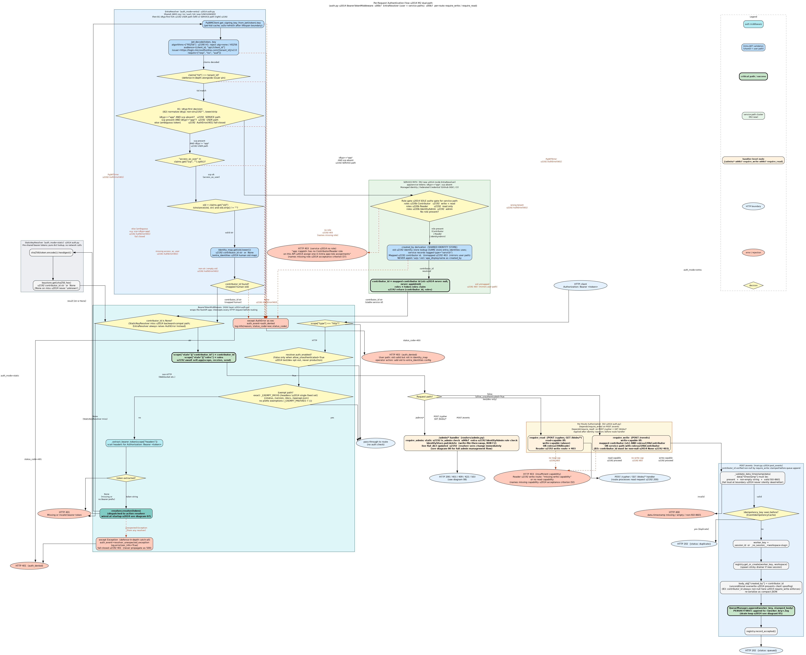
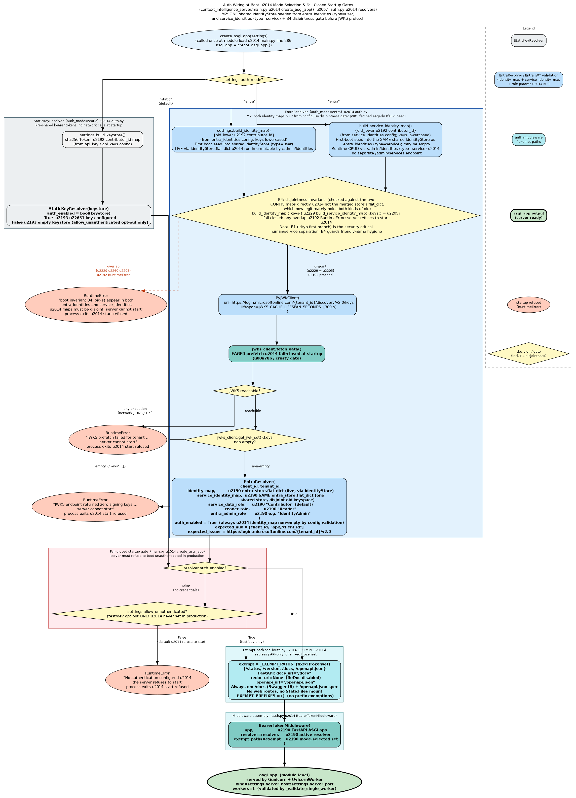
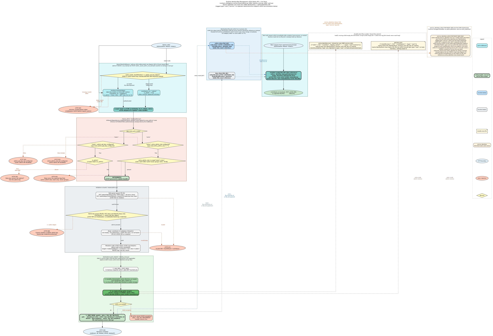
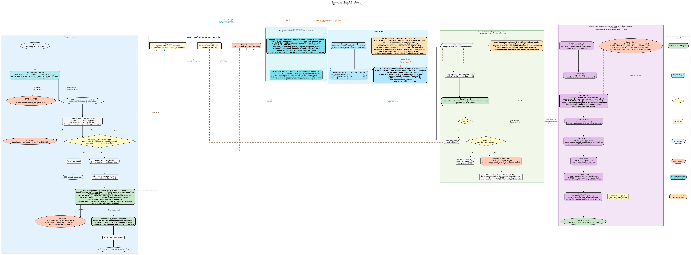
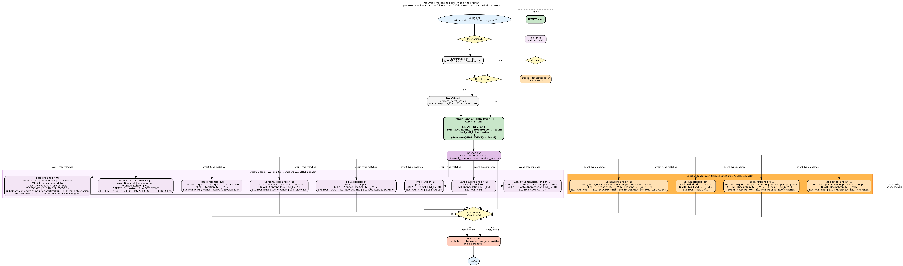
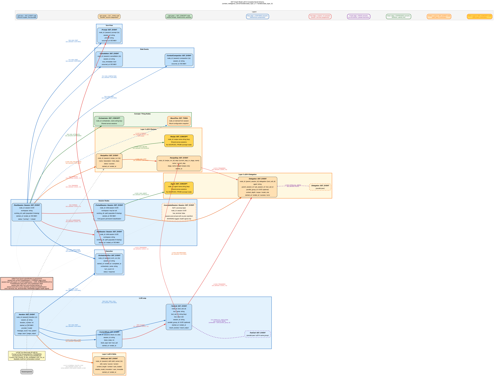
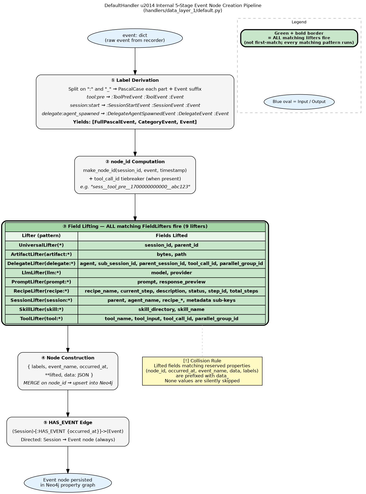

# Architecture Diagrams

This file is the entry point for all architecture documentation and the consumer for the
rendered diagrams. PNG files are rendered from the `.dot` sources in this directory and are
the tracked artifact — they exist to be embedded in this README.

---

> **Note:** PNGs are rendered from the `.dot` sources and committed alongside them. After
> editing a `.dot` file, re-render with the command in the
> [Regenerating PNGs](#regenerating-pngs) section at the bottom of this file.

## Auth Middleware Position in the Stack

`BearerTokenMiddleware` sits as ASGI middleware **upstream of all HTTP routes** — it wraps
the FastAPI application and intercepts every HTTP request before routing begins. The
middleware validates the `Authorization: Bearer <token>` header, resolves the token to a
contributor id via the active `PrincipalResolver`, and injects `contributor_id` into
`scope["state"]` for downstream handlers; it short-circuits with `401` or `403` on any auth
failure before the FastAPI route handler is ever invoked. The server is headless (API-only),
so a single fixed set of paths is always exempt — `{/status, /version, /docs, /openapi.json}`
(health/version plus the always-on OpenAPI/Swagger surface). See diagram 06 for the complete
per-request decision flow and diagram 07 for how the
resolver and exempt-path set are wired at boot time.

---

## Diagrams

| # | File | What it shows |
|---|------|---------------|
| 01 | [01-pipeline-flow.dot](./01-pipeline-flow.dot) | Per-event processing spine within the drainer |
| 02 | [02-handler-architecture.dot](./02-handler-architecture.dot) | Handler class-level architecture |
| 03 | [03-graph-model.dot](./03-graph-model.dot) | Neo4j property-graph schema |
| 04 | [04-default-handler-flow.dot](./04-default-handler-flow.dot) | DefaultHandler internal decision flow |
| 05 | [05-durable-ingest-queue.dot](./05-durable-ingest-queue.dot) | Durable ingest queue + drain loop (incl. auth middleware entry) |
| 06 | [06-auth-flow.dot](./06-auth-flow.dot) | **Per-request auth flow** — BearerTokenMiddleware → resolver dispatch → `/admin/*` branch or `post_events` |
| 07 | [07-auth-startup.dot](./07-auth-startup.dot) | **Auth boot wiring** — mode selection, JWKS prefetch, fail-closed gate, exempt-path selection |
| 08 | [08-identity-map-management.dot](./08-identity-map-management.dot) | **Runtime identity-map management** — admin API, `require_admin` gate, `IdentityStore` write-then-swap, live `flat_dict`, no-redeploy proof |

---

## Auth Flow (per-request)



**Source:** [`06-auth-flow.dot`](./06-auth-flow.dot)

The complete per-request authentication decision flow — updated in **M2** to add a dual-path
`EntraResolver` (user + service) and per-route capability checks. Every HTTP request enters
`BearerTokenMiddleware`, which checks whether the path is exempt, extracts the bearer token,
and dispatches to the active `PrincipalResolver`. After identity and roles are injected into
scope state, a **path dispatch** routes requests to the admin handler (diagram 08) or to a
per-route capability gate before the data route handler.

- **`StaticKeyResolver` (auth_mode=static):** `sha256(token)` → keystore lookup → contributor
  id or `None` → 401.
- **`EntraResolver` (auth_mode=entra) — M2 dual-path:** JWKS signing-key fetch → `jwt.decode`
  (RS256, dual audience `[client_id, api://client_id]`, issuer, `exp`/`iss`/`aud` required)
  → `tid` check → **B1 `idtyp`-first decision** (gate placed _before_ `ScpCheck`):
  - **USER path** (`scp` present AND `idtyp != "app"`) — Option A, unchanged: `scp` contains
    `access_as_user` → `oid` validated → `identity_map[oid.lower()]` → contributor id;
    unmapped oid → `AuthError(403)`. Delegated-user behavior is byte-for-byte identical to M1.
  - **SERVICE path** (`idtyp == "app"` AND `scp` absent — M2 new): **role gate is the sole
    authz gate** — admit iff `roles` contains `Contributor` (write + read), `Reader`
    (read only), or `IdentityAdmin` (admin); no role → `AuthError(403)` whose message names
    the missing role (`"app <appid> has no Contributor/Reader role on this API — assign
    one"`). `created_by` is then resolved **exactly like the user path**: `oid` → the
    **shared identity store** (the same store backing `entra_identities`;
    service records carry `type: "service"`) → contributor id. An `oid` with **no**
    mapping is a second, distinct `AuthError(403)` naming the principal (fail-loud,
    mirrors the user path's unmapped-oid 403) — **`created_by` is never**
    `appid`/`azp`/`oid`/`app_displayname` (those are raw, spoofable-or-machine claims,
    not contributors).
  - **Ambiguous token** (both `scp` + `idtyp=="app"`, or neither) → `AuthError(401)`,
    fail-closed (B1 mutual-exclusion, prevents namespace bleed).
  - **(B2)** `idtyp` is normalized before comparison: non-string → `""`, lower/strip.
  - All failures raise `AuthError(401/403)`, logged at INFO with `auth_event=auth_denied`;
    unexpected resolver exceptions are caught, logged at ERROR, and fail-closed as `401`.

- **Per-route authorization (D2 — M2 new):** downstream of identity injection, two
  capability gates are applied via FastAPI `Depends()` before the route handler:
  - `require_write` (`POST /events`): write-capable iff mapped contributor AND
    `roles ∋ Contributor`, or service path with `roles ∋ Contributor`. A `None`
    contributor on a write route is hard-403 (B3 — never stamps `created_by=None`).
  - `require_read` (`POST /cypher`, `GET /blobs/*`): read-capable iff write-capable OR
    `roles ∋ Reader`. Reader → write route = 403 with named capability message.
  - `/admin/*` is unchanged: `require_admin` checks `IdentityAdmin` role (entra) or
    `is_admin` flag (static).

On success, `contributor_id` and `roles` are both injected into `scope["state"]`. The
`post_events` handler validates `data.timestamp` (→ 400 on missing/invalid), checks
idempotency, stamps `body["created_by"] = contributor_id` (write-once, prevents client
spoofing), and appends the stamped body to the durable queue (→ 202).

> **Authorization ownership note (D7):** "who can write" for service tokens is now determined
> by Entra app-role assignments (`Contributor`/`IdentityAdmin` on the API SP), not a local
> allow-list. This is an intentional, auditable admin act — but it means periodic review of
> Contributor/IdentityAdmin holders in Entra is a named operational responsibility.

---

## Auth Startup Wiring



**Source:** [`07-auth-startup.dot`](./07-auth-startup.dot)

How authentication is wired at boot inside `create_asgi_app()`. The function branches on
`auth_mode`:

- **`static`:** builds `StaticKeyResolver(build_keystore())` — pure dict, no network.
- **`entra` (M2 updated):** seeds **one shared `IdentityStore`**
  from config, checks the B4 disjointness invariant, eagerly fetches JWKS, and
  constructs `EntraResolver` with five parameters. Specifically:
  1. **First-boot seed:** `build_identity_map()` (`entra_identities`, entries
     default to `type: "user"`) and `build_service_identity_map()`
     (`service_identities`, entries tagged `type: "service"`) are merged into one
     `rich_seed` and written into the **same** `entra_identities_store_path`
     `IdentityStore` via `seed()` — only when the store file doesn't exist yet (a
     pre-existing store, e.g. after an `/admin/identities` mutation, is loaded as-is;
     config never overwrites runtime-managed data).
  2. **B4 disjointness invariant** (fail-closed gate before JWKS fetch): checked
     against the **two config maps directly** — `build_identity_map().keys() ∩
     build_service_identity_map().keys() ≠ ∅` → `RuntimeError`, refuses to start.
     (Checked against the config maps, not the merged store's `flat_dict`, which now
     legitimately holds both kinds of oid by design.)
  3. **JWKS prefetch** — `PyJWKClient.fetch_data()` eagerly; fail-closed if the endpoint
     is unreachable or returns zero keys (`RuntimeError`, server refuses to start).
  4. **`EntraResolver(client_id, tenant_id, identity_map, service_identity_map,
     service_data_role, reader_role, entra_admin_role)`** — both `identity_map` and
     `service_identity_map` are passed the **same live `IdentityStore.flat_dict`
     reference** (one shared store, disjoint oid keyspace makes this safe): an
     admin-onboarded service mapping (`PUT /admin/identities`, `type=service`)
     resolves immediately, exactly like a user mapping — see diagram 08.

A fail-closed gate then rejects boot if `resolver.auth_enabled` is `False` and
`allow_unauthenticated` is not set (the latter is a test/dev-only opt-out, never for
production). The server is headless, so the exempt-path set is a single fixed frozenset —
`{/status, /version, /docs, /openapi.json}` — with no exempt prefixes. Finally,
`BearerTokenMiddleware(app, resolver, exempt_paths=_EXEMPT_PATHS)` is assembled and returned
as `asgi_app` (served by Gunicorn + uvicorn).

---

## Runtime Identity-Map Management



**Source:** [`08-identity-map-management.dot`](./08-identity-map-management.dot)

End-to-end flow for runtime identity-map management via the `/admin/*` API — no server restart
required for any mutation. The diagram covers both the **entra-identities store** (oid →
contributor) and the **api-keys store** (sha256 hash → contributor) through a single shared
`IdentityStore` abstraction.

> **Update:** service identities are now managed through this **same**
> `/admin/identities` API — there is deliberately **no separate** `/admin/services`
> endpoint. Every identity record (`PUT`/`GET`/`DELETE /admin/identities`) carries a
> `type: "user" | "service"` field (default `"user"`); `GET /admin/identities?type=service`
> filters the listing to service records only. `service_identities` config remains a
> **first-boot-only seed** into the same durable store `entra_identities` uses — it may
> be empty/omitted, and service callers added after boot go through
> `PUT`/`DELETE /admin/identities` (`type=service`), no redeploy needed. Records written
> before this field existed are normalized to `type: "user"` on load and persisted back
> (best-effort migration — a read-only-fs write failure logs a warning and keeps the
> normalized data in memory only). See diagram 07 for how the shared store is seeded at
> boot alongside the B4 disjointness gate.

**Authorization gate (`require_admin`):** applied router-wide via
`APIRouter(dependencies=[Depends(require_admin)])`. The middleware (`BearerTokenMiddleware`)
handles authentication first — `/admin/*` paths are never exempt (TB-07 startup assertion).
`require_admin` then enforces *authorization*:

- **Static mode:** `admin_api_key_configured` on `app.state` → 503 if unconfigured; `is_admin`
  flag in scope state → 403 if False (data key used). The admin key is recognized by the
  middleware before the data keystore is consulted (ROB F1); it resolves to
  `contributor_id="admin"`, `is_admin=True`.
- **Entra mode:** `entra_admin_role` on `app.state` → 503 if empty; `IdentityAdmin` (or the
  configured role) in the token's `roles` claim → 403 if absent. Only the `roles` claim is
  checked — `groups` can never grant admin access (TB-09).

**Validation and guards:** path-param guard (GUID regex + all-zeros check for OIDs; 64-hex
check for key hashes) → 422; admin-key guard (hash of `admin_api_key` cannot be shadowed or
deleted via the API) → 409; contributor-id body validation (non-empty, ≤256 chars, no null
bytes, TB-12) → 422; structured audit line to stdout → Log Analytics before every successful
mutation (raw keys are never logged).

**`IdentityStore` commit order (ROB F2 — non-negotiable):** `put` / `delete` build a snapshot
of the current data dict, write it to a tempfile in the same directory, `fsync`, then
`os.replace` (atomic on POSIX and Azure Files) onto the target. Only after the file write
succeeds are `_data` and `flat_dict` updated in-place. A write failure leaves memory
unchanged; the handler returns 5xx. The persistent JSON file and in-process dict are never
out of sync.

**Live in-process dict (no-redeploy proof):** `IdentityStore.flat_dict` is the same dict
object passed by reference to the active resolver at startup
(`StaticKeyResolver(key_store.flat_dict)` / `EntraResolver(…, entra_store.flat_dict, …)`).
After `StUpdateMem`, the resolver's keystore/identity-map is already updated — the very next
authenticated request resolves the new principal immediately after a `PUT`, or is rejected
immediately after a `DELETE` (no cache, no TTL, no restart).

**Load-time fail-closed:** on `IdentityStore.load()`, a missing file → empty dict (normal
first boot); a corrupt / partial / invalid-JSON file → empty dict + loud `logger.error` /
`logger.critical` — the server never crash-loops on a bad store file, but every auth attempt
fails until an admin re-populates via the `/admin` API.

---

## Durable Ingest Queue & Drain Loop



**Source:** [`05-durable-ingest-queue.dot`](./05-durable-ingest-queue.dot)

The headline of the durable-ingest work and the most important view of the system today.
Requests enter via `BearerTokenMiddleware` (auth gate — see diagram 06) and are rejected
with `401`/`403` before reaching the route handler if credentials are missing or invalid.
`POST /events` then validates `data.timestamp` (→ 400 on failure), stamps `created_by`
from the verified contributor id, persists the event to a durable per-session append-log,
and returns `202` immediately (persist-then-202); an async single drainer per session
processes batches and flushes them to Neo4j under a global write semaphore, retrying
transient/deadlock failures and isolating poison events to a dead-letter file. Durable files
per session are `<worker_key>.log` (append-only raw events — `created_by`-stamped),
`<worker_key>.offset` (last committed byte position), and `<worker_key>.dead.jsonl` (poison
records). On startup the server replays unprocessed log lines and re-seeds counters from
disk (crash recovery). Live conservation metrics surface on `/status`, and authenticated
`/queues/dead-letter` endpoints support inspect, replay, and purge.

---

## Pipeline Flow



**Source:** [`01-pipeline-flow.dot`](./01-pipeline-flow.dot)

The per-event processing spine **within the drainer** — invoked by `registry.drain_worker`,
not by the HTTP request directly. Shows how a single dequeued event moves through the
`EventPipeline`, dispatcher, handler registry, and into the graph store. See diagram
[05](#durable-ingest-queue--drain-loop) for where this spine sits in the persist-then-202
ingest/drain flow.

---

## Handler Architecture


**Source:** [`02-handler-architecture.dot`](./02-handler-architecture.dot)

Class-level view of the handler layer. Shows the `BaseHandler` protocol, the registry,
and every concrete handler (`SessionHandler`, `ToolCallHandler`, `DefaultHandler`, etc.)
with their data-layer variant relationships.

---

## Graph Model



**Source:** [`03-graph-model.dot`](./03-graph-model.dot)

Property-graph schema stored in Neo4j. Nodes (`Session`, `Event`, `ToolCall`, `Blob`)
and their typed relationships (`HAS_EVENT`, `EMITTED`, `REFERENCES_BLOB`).

---

## Neo4j client topology

The server connects to Neo4j through **three drivers**, each with a distinct job.

Two are owned by the lifespan. The **admin driver** (`neo4j_driver`) is opened in
**WRITE** access mode and handles boot-time and operational work: schema creation,
the untagged-node integrity check, and the `/status` connectivity probe. The
**cypher_query driver** (`neo4j_query_driver`) is opened in **READ** access mode and
serves `POST /cypher` reads. Both are created together at startup and closed
together at shutdown. With legacy flat config (`neo4j_url` / `neo4j_user` /
`neo4j_password`), both fall back to the same endpoint and shared credentials,
differing only by access-mode hint; a structured `neo4j:` block lets the read driver
take a separate credential and/or URL (e.g. a read replica). Their connection health
is reported independently on `/status` as `neo4j_connected` (admin) and
`neo4j_query_connected` (cypher_query).

The third is the **shared session driver**, owned by `SessionRegistry`, and it is the
one that carries the **ingest path** — every per-session `Neo4jGraphStore`'s batch
flushes. It is built lazily on the first session (from the same resolved admin client
config) with a bounded pool (`neo4j_max_connection_pool_size`, default 50) and
injected into every store, so a per-session finalize can never close the driver other
live sessions are still using. Before it existed, each session built and held its own
unshared driver, which is how bolt connections accumulated until the server's thread
pool starved. It is closed exactly once, at shutdown, and only *after*
`SessionRegistry.shutdown_workers()` has quiesced the drain workers — closing it
under a live drainer makes that drainer exhaust its retry budget and dead-letter
healthy queued events.

Because `/status` probes only the admin and cypher_query drivers,
`neo4j_connected: true` does **not** by itself mean the ingest path is healthy.
Ingest health is visible through the pipeline-conservation counters in the `metrics`
block (`written_total`, `residual`, `degraded`).

> **Note:** the existing `.dot` diagrams (e.g. `05-durable-ingest-queue`) show only
> the **write path**, and label it as the admin driver — that write path is now the
> shared session driver. The three-driver split is not yet rendered in any diagram —
> a dedicated topology diagram is a known follow-up. This prose subsection is the
> interim reference; no new `.dot` is authored in this pass.

---

## DefaultHandler Flow



**Source:** [`04-default-handler-flow.dot`](./04-default-handler-flow.dot)

Internal decision flow of `DefaultHandler.handle()`: field lifting, blob extraction,
threshold checks, and the conditional path to graph upsert vs. pass-through.

---

## Regenerating PNGs

PNG files are rendered from the `.dot` source files in this directory and are the tracked
artifact. To re-render a single diagram after editing its `.dot` source:

```sh
dot -Tpng -o NAME.png NAME.dot
```

To re-render all diagrams after editing any `.dot` file, run the following from the project root:

```sh
for f in docs/architecture/*.dot; do dot -Tpng "$f" -o "${f%.dot}.png"; done
```

> **Note:** PNG files exist only to be embedded in this README. Do not reference them
> directly from other documents — update the `.dot` sources and re-render instead.
