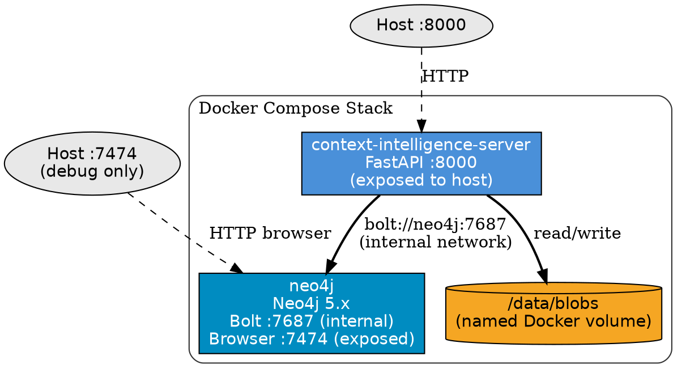

# Context Intelligence Server Design

## Goal

Extract the Context Intelligence hook's graph processing and blob management out of the in-process Amplifier hook into a standalone server. The bundle's `LoggingHandler` remains in-process (JSONL stays local); everything else — handler dispatch, session cursor state, Neo4j writes, blob storage — moves to the server. Clients (bundle instances, analyst agents, Cypher skill) configure a single server URL.

## Background

The current Context Intelligence architecture runs all graph processing — event handling, Neo4j writes, blob storage, session state management — inside the Amplifier process via `GraphDataHook`. This couples graph infrastructure to every Amplifier session, requires each client to maintain its own Neo4j connection, and makes blob data inaccessible across sessions. The `BlobTool` is not wired into the production mount path. `schedule_flush()` is never called by any handler, so intermediate writes accumulate in buffer indefinitely until a terminal event. The `graph_forest_name` resolution depends on a lazy `coordinator.config["project_slug"]` lookup that silently defaults to `"default"` with no retroactive correction.

Moving to a standalone server centralizes graph infrastructure, enables shared blob access, provides operational visibility via a dashboard, and cleanly separates the durable local log (`LoggingHandler` → JSONL) from the graph-building pipeline.

## Approach

**Standalone FastAPI server in Docker Compose** alongside Neo4j, with the bundle slimmed to `LoggingHandler` (enhanced with fire-and-forget HTTP dispatch), `ConfigResolver`, `BlobTool` (updated to HTTP client), and `protocol.py`.

**Why this approach:**

- **Single server URL** replaces per-client Neo4j connection management
- **Fire-and-forget ingestion** keeps bundle-side latency near zero — JSONL remains the durable record
- **Centralized blob storage** on a Docker volume makes blobs accessible to any client via HTTP
- **Cypher proxy** (`POST /cypher`) keeps Bolt internal to the Docker network; external clients never need direct Neo4j access
- **Operational dashboard** provides visibility into session state, queue depths, and Neo4j health without external tooling
- **Same handler code** — the seven existing handlers move to the server with minimal modification, preserving all graph-building logic

## Architecture

### Docker Compose Topology

Two services compose the stack:



### Full Interaction Diagram

```dot
digraph context_intelligence_architecture {
    rankdir=LR;
    node [shape=box, fontname="Helvetica"];
    edge [fontname="Helvetica", fontsize=10];

    subgraph cluster_amplifier {
        label="Amplifier Applications (multiple concurrent)";
        style=dashed;
        color="#666666";
        fontname="Helvetica";

        logging_handler [label="LoggingHandler\n(events.jsonl local)"];
        blob_tool [label="BlobTool\n(HTTP client)"];
        cypher_skill [label="Cypher Skill\n(HTTP client)"];
    }

    subgraph cluster_server {
        label="context-intelligence-server (Docker Compose)";
        style=solid;
        color="#333333";
        fontname="Helvetica";

        subgraph cluster_fastapi {
            label="FastAPI :8000";
            style=rounded;

            events_endpoint [label="POST /events"];
            blobs_endpoint [label="GET /blobs/{sid}/{key}\nGET /blobs/{sid}"];
            cypher_endpoint [label="POST /cypher"];
            status_endpoint [label="GET /status\nGET / (dashboard)"];
        }

        subgraph cluster_processing {
            label="Async Processing";
            style=rounded;

            session_registry [label="SessionRegistry\ndict[session_id → SessionWorker]"];
            session_worker [label="SessionWorker\nasyncio.Queue + Task\n+ HookStateService"];
            handlers [label="7 Event Handlers\n(SessionHandler, OrchestratorRunHandler,\nStepHandler, ToolExecutionHandler,\nRecipeHandler, SystemEventHandler,\nDefaultHandler)"];
        }

        blob_volume [label="Blob Storage\n/data/blobs\n(Docker volume)", shape=cylinder];
        neo4j_node [label="Neo4j :7687\n(internal)", shape=cylinder];
        neo4j_browser [label="Neo4j Browser :7474\n(exposed for debugging)"];
    }

    logging_handler -> events_endpoint [label="POST /events\n{event, workspace, data}"];
    blob_tool -> blobs_endpoint [label="GET /blobs/{sid}/{key}"];
    cypher_skill -> cypher_endpoint [label="POST /cypher\n{query, params, workspace}"];

    events_endpoint -> session_registry [label="enqueue"];
    session_registry -> session_worker;
    session_worker -> handlers;
    handlers -> neo4j_node [label="bolt (internal)"];
    session_worker -> blob_volume [label="async write"];
    blobs_endpoint -> blob_volume [label="async read"];
    cypher_endpoint -> neo4j_node [label="bolt proxy"];
    neo4j_node -> neo4j_browser [label="http :7474"];
}
```



## Components

### 1. Docker Compose Stack

Two services:

| Service | Image | Ports | Notes |
|---|---|---|---|
| `context-intelligence-server` | Custom FastAPI image | `8000` (exposed) | Single entry point for all programmatic access |
| `neo4j` | `neo4j:5.x` | `7474` (exposed, debug), `7687` (internal only) | Bolt stays internal to Docker network |

Named Docker volume for blob persistence mounted at `/data/blobs` inside the server container.

### 2. API Surfaces

Six endpoints on the FastAPI server:

| Method | Path | Purpose | Response |
|---|---|---|---|
| `POST` | `/events` | Event ingestion (fire-and-forget) | `202 Accepted` |
| `GET` | `/blobs/{session_id}/{key}` | Blob content retrieval | JSON |
| `GET` | `/blobs/{session_id}` | List all blob URIs for a session | JSON array of `ci-blob://` URIs |
| `POST` | `/cypher` | Proxy Cypher queries to Neo4j | JSON results |
| `GET` | `/` | Minimal operational dashboard | HTML |
| `GET` | `/status` | Server health + session state (Docker healthcheck) | JSON |

### 3. Event Ingestion Pipeline

**POST /events payload:**

```json
{
  "event": "tool:pre",
  "workspace": "my-feature-branch",
  "data": {
    "session_id": "abc-123",
    "timestamp": "2026-03-13T14:30:00Z",
    "..."
  }
}
```

Three envelope fields:

- **`event`** — the event name (e.g. `tool:pre`, `session:start`)
- **`workspace`** — groups multiple sessions under one scope; maps to the `workspace` property on Neo4j nodes/edges (replaces `graph_forest_name` in the API vocabulary; the internal Neo4j property is also renamed to `workspace`)
- **`data`** — full event payload; `session_id` and `timestamp` are extracted from here server-side

**Processing flow:**

1. Extract `session_id` from `data.get("session_id")`
2. Look up or create `SessionWorker` in `SessionRegistry`
3. Enqueue `(event, workspace, data)` to the session's `asyncio.Queue`
4. Return `202 Accepted` immediately

Transport from the bundle is fire-and-forget. If POST fails, `LoggingHandler` logs a warning and continues — the JSONL log is the durable record.

### 4. Session State & Handler Dispatch

**SessionRegistry** — `dict[session_id → SessionWorker]`, shared across the FastAPI application lifecycle. Workers are created lazily on the first event for a session.

**SessionWorker** per session contains:

- `asyncio.Queue` — FIFO event buffer (preserves per-session ordering)
- `asyncio.Task` — background drain coroutine
- `HookStateService` — carries `SessionCursors`, `_seen_sessions`, Neo4j buffer
- `workspace` — resolved from the first event's envelope field, fixed for the session lifetime

**Drain loop** (server-side equivalent of `_wrap_with_session_guarantee`):

```
for each event dequeued:
    try:
        ensure_session_node(session_id, data)     # idempotent session stub
        in_place_blob_transform(data)             # replace blob fields in-place
        dispatch to matching handler              # same 7 handlers as today
        if terminal event: await flush()          # session:end, execution:end, orchestrator:complete
    except Exception:
        log structured error, continue            # never propagate to HTTP layer
```

**Key difference from current in-process code:** `copy.deepcopy(data)` is dropped. The server owns the deserialized JSON dict exclusively — no other handler shares it — so in-place field replacement is safe.

**Concurrency model:**

- All workers share one asyncio event loop
- Per-session queues guarantee ordering within a session
- Different sessions process fully concurrently
- No locking required — asyncio cooperative multitasking means `_seen_sessions` and `_cursors` are guarded by the single-threaded model

**Flush discipline:**

| Trigger | Mechanism |
|---|---|
| Terminal events (`session:end`, `execution:end`, `orchestrator:complete`) | Direct `await flush()` |
| Time-based fallback (30s periodic per active worker) | Protects against sessions that disconnect without clean termination |

The 30s periodic flush is essential: currently there are zero `schedule_flush()` calls in any handler — all intermediate writes sit in buffer indefinitely until a terminal event.

**Worker cleanup:** On `session:end` fully processed — drain remaining queue items, final `await flush()`, remove from registry.

### 5. Blob Storage & HTTP Serving

**Storage:** Named Docker volume mounted at `/data/blobs` inside the container. Filesystem layout unchanged from `DiskBlobStore`:

```
/data/blobs/<session_id>/blobs/<key>.json
```

Key format: `{node_id}__{field_name}` (double-underscore separator, as today).

**Async I/O fix:** Current `DiskBlobStore` methods are `async def` but contain entirely synchronous filesystem calls (`path.write_text`, `path.read_text`, etc.) — they block the event loop. In the server, all filesystem operations are wrapped with `asyncio.to_thread(...)` for genuinely non-blocking I/O.

**URI scheme:** `ci-blob://` is kept as the internal reference in Neo4j properties. This avoids embedding a hostname into stored data — the server resolves `ci-blob://{session_id}/{key}` to a filesystem path internally. URIs stored in Neo4j remain stable regardless of server hostname.

**Bundle `BlobTool` update:** Currently hardcoded to `DiskBlobStore` and not wired into the production mount path (floating artifact). Updated to:

1. Accept server URL configuration instead of `DiskBlobStore`
2. Use `GET /blobs/{session_id}/{key}` for `blob_dump`
3. Use `GET /blobs/{session_id}` for `blob_list` (drops local `path.stat()` calls)
4. Properly registered in mount path via `graph_data_hook.py` or `MountFlow.run()`

### 6. Bundle Changes

Minimal changes to `amplifier-bundle-context-intelligence`:

**`LoggingHandler` enhanced** — if `server_url` and `workspace` are configured, the handler fires `asyncio.create_task(post_to_server(event, workspace, data))` in parallel with its JSONL write. Fire-and-forget: task failure logs a warning, never affects the handler's return. This eliminates the need for a dedicated `RemoteGraphHook` class.

**`GraphDataHook` not mounted** when `server_url` is configured. Two mutually exclusive modes:

| Mode | Components | Use case |
|---|---|---|
| **Local** (today's behavior) | `LoggingHandler` + `GraphDataHook` (local Neo4j) | Development, standalone |
| **Server** (new) | `LoggingHandler` with `server_url` + `workspace`; dispatches to server in parallel with local JSONL | Production, multi-client |

**What moves to server repo** (`amplifier-context-intelligence`):

- `MountFlow` (entire flow)
- All 7 handlers: `SessionHandler`, `OrchestratorRunHandler`, `StepHandler`, `ToolExecutionHandler`, `RecipeHandler`, `SystemEventHandler`, `DefaultHandler`
- `HookStateService`, `SessionCursors`
- `Neo4jGraphStore`, `DiskBlobStore`
- `blob_processor.py`

**What stays in bundle:**

- `LoggingHandler` (enhanced)
- `ConfigResolver`
- `BlobTool` (updated to HTTP client)
- `protocol.py`

## Data Flow

### Event Ingestion (happy path)

```
Amplifier Session
    │
    ├─► LoggingHandler
    │       ├─► Write to events.jsonl (local, synchronous)
    │       └─► asyncio.create_task(POST /events)  [fire-and-forget]
    │               │
    │               ▼
    │       context-intelligence-server :8000
    │               │
    │               ├─► Extract session_id from data
    │               ├─► Lookup/create SessionWorker in SessionRegistry
    │               ├─► Enqueue (event, workspace, data)
    │               └─► Return 202 Accepted
    │
    │       SessionWorker drain loop (async):
    │               │
    │               ├─► ensure_session_node()
    │               ├─► in_place_blob_transform()
    │               │       └─► DiskBlobStore.write() via asyncio.to_thread()
    │               ├─► dispatch to handler
    │               │       └─► handler.handle(event, data, state)
    │               ├─► [if terminal] await flush()
    │               │       └─► Neo4jGraphStore.write_batch() via bolt
    │               └─► [periodic] 30s flush fallback
    │
    └─► (session continues normally, unblocked)
```

### Blob Retrieval

```
BlobTool / Analyst Agent
    │
    ├─► GET /blobs/{session_id}/{key}
    │       │
    │       ▼
    │   Server reads /data/blobs/{session_id}/blobs/{key}.json
    │       │
    │       └─► Returns JSON content
    │
    └─► GET /blobs/{session_id}
            │
            ▼
        Server lists /data/blobs/{session_id}/blobs/*.json
            │
            └─► Returns array of ci-blob:// URIs
```

### Cypher Query Proxy

```
Cypher Skill / Analyst Agent
    │
    └─► POST /cypher { query, params, workspace }
            │
            ▼
        Server executes query against Neo4j via bolt://neo4j:7687
            │
            └─► Returns JSON results
```

## Operational Visibility

### Minimal Dashboard (`GET /`)

Static HTML page with vanilla JS, polls `GET /status` every few seconds:

- **Server health:** uptime, Neo4j connection status, blob volume bytes used
- **Active sessions table:** session_id, workspace, queue depth, last event, last flush time, worker status
- **Recent activity:** last 50 processed events (timestamp, event name, session, result)
- No authentication (local Docker infrastructure)

`GET /status` doubles as the Docker Compose healthcheck endpoint.

### Structured Server-Side Logging

JSON-formatted operational logs for all server-side events:

- Event received, enqueued, processed
- Handler result (success/failure)
- Flush triggered/completed
- Worker created/destroyed
- Neo4j errors
- Blob write failures

## Key Implementation Notes from Codebase Investigation

These findings from deep investigation of the existing bundle inform specific server design decisions:

| # | Finding | Server Implication |
|---|---|---|
| 1 | `_wrap_with_session_guarantee` has no `try/except` | Server drain loop adds `try/except` per event — errors logged, never propagate |
| 2 | `make_node_id` raises on empty timestamp (`datetime.fromisoformat("")` → `ValueError`) | Drain loop catches this; individual handlers should also be hardened |
| 3 | `schedule_flush()` is never called by any handler — all intermediate events accumulate in buffer until a terminal event | 30s periodic flush is essential for the server context |
| 4 | `_seen_sessions` is never cleared (add-only set) | Acceptable for server — workers are cleaned up per-session |
| 5 | `SessionCursors.current_step_id` never cleared between runs — creates cross-run `NEXT` edge chain | May be intentional but undocumented; preserve behavior, document it |
| 6 | `SystemEventHandler` is a complete no-op — claims `context:compaction`, `cancel:requested`, `cancel:completed` to prevent DefaultHandler from seeing them; no graph nodes written | Carry forward as-is; no-op is the intended behavior |
| 7 | `BlobTool` not wired in production mount path (floating artifact) | Must be fixed during server migration — register properly |
| 8 | `DiskBlobStore.read()` ignores URI's session_id — uses caller-provided `session_id` for path resolution | Potential footgun; document in server implementation |
| 9 | `execution:end` + `orchestrator:complete` both trigger flush — double flush in normal operation | Second is a no-op but adds Neo4j round-trip latency; consider dedup |
| 10 | `graph_forest_name` resolved lazily on first event — if no `project_slug` in coordinator config, defaults to `"default"` with no retroactive correction | In server, `workspace` from POST envelope replaces this entirely |

## Naming Conventions

| Old | New | Notes |
|---|---|---|
| `graph_forest_name` | `workspace` | All Neo4j node/edge properties and API vocabulary |
| `project_slug` | *(dropped)* | Concept removed from server vocabulary entirely |
| Server service name | `context-intelligence-server` | Never abbreviated to "CI" |

Internal Python variable names may keep `graph_forest_name` for compatibility during migration, with `workspace` as the public-facing name.

## Error Handling

- **Bundle → Server transport failure:** `LoggingHandler` logs a warning and continues. JSONL is the durable record; server ingestion is best-effort.
- **Server drain loop exceptions:** Caught per-event with structured logging. The worker continues processing the next event. Errors never propagate to the HTTP layer.
- **Neo4j unavailability:** Flush failures are logged. Buffered writes remain in memory for retry on the next flush cycle (terminal event or 30s periodic).
- **Blob write failures:** Logged with session_id and key context. The `ci-blob://` URI is still written to Neo4j (points to a missing file); retrieval returns a clear error.
- **Worker cleanup on dirty disconnect:** 30s periodic flush ensures buffered data reaches Neo4j even if `session:end` never arrives. Workers for abandoned sessions are eventually reaped.

## Testing Strategy

- **Unit tests** for `SessionRegistry`, `SessionWorker` drain loop, blob path resolution, event envelope parsing
- **Integration tests** against a real Neo4j container — verify handler dispatch produces correct graph structure via Cypher assertions
- **API tests** using `httpx.AsyncClient` / FastAPI `TestClient` — verify 202 response, blob retrieval, Cypher proxy, status endpoint
- **Fire-and-forget tests** — verify `LoggingHandler` continues normally when server is unreachable
- **Flush discipline tests** — verify terminal events trigger immediate flush; verify 30s periodic flush fires for long-running sessions
- **End-to-end** — replay a captured JSONL log against the server, verify resulting graph matches expected structure

## Open Questions

1. **`workspace` sourcing in bundle** — How the `LoggingHandler` resolves `workspace` to send to the server (from `project_slug`, working directory, explicit config, or other). Deferred.
2. **Auth between bundle and server** — API key, mTLS, or similar mechanism for securing the transport. Deferred.
3. **Future: embedded Amplifier application** — An Amplifier session with `context-intelligence-analyst` agent pre-configured, accessible from the dashboard, for ad-hoc graph exploration and querying without external setup. Tabled for future iteration.
