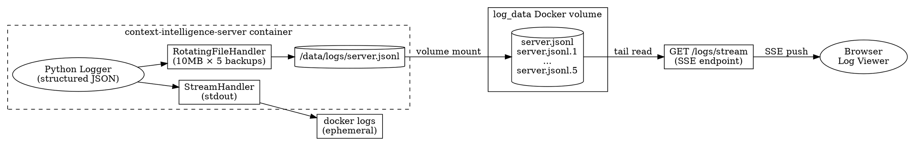
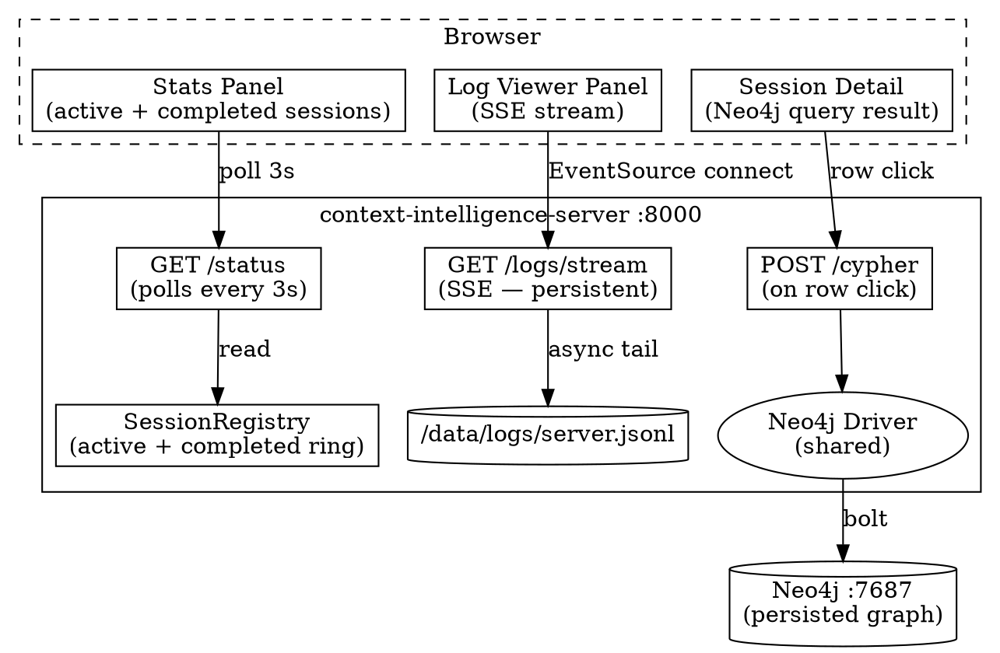

# Worker Cleanup, Log Persistence & Dashboard Enhancement Design

## Goal

Three related improvements to the Context Intelligence Server: fix the worker memory/connection leak by adding proper lifecycle cleanup, persist operational logs across restarts, and enhance the dashboard with session history, live log tailing via SSE, and Neo4j-backed session inspection.

## Background

The server has three operational gaps that compound in production:

1. **Worker leak** — Workers are never removed from `SessionRegistry` after a session ends. Each worker holds an open Neo4j driver connection and occupies memory in the `_workers` dict indefinitely. Over time this exhausts connection pools and memory.
2. **Ephemeral logs** — All structured log output goes exclusively to Docker stdout. On container restart every log line is lost, making post-incident investigation impossible without an external aggregator (which we don't run).
3. **Limited dashboard** — The current dashboard shows only active sessions. There is no visibility into completed sessions, no way to inspect the Neo4j graph for a session, and no live log stream for real-time monitoring.

These three features share a common surface area (the registry, the status endpoint, and the dashboard HTML) so they are designed together.

## Approach

- **Worker cleanup**: Self-terminating drain loop. The worker's own coroutine handles its end-of-life sequence — flush, close, deregister, return. No external reaper thread or scheduled task.
- **Log persistence**: A second Python log handler (`RotatingFileHandler`) writing to a Docker named volume. No sidecar, no log shipper — the file on the volume is the log store.
- **Dashboard**: Extend the existing `/status` endpoint and dashboard HTML. Add SSE for log streaming. Use the existing `/cypher` endpoint for on-demand Neo4j queries triggered by row clicks.

## Architecture

### Worker Lifecycle State Machine

```dot
digraph worker_lifecycle {
    rankdir=LR;
    node [shape=box, style=rounded];

    CREATED [label="CREATED\n(get_or_create)"];
    DRAINING [label="DRAINING\n(drain_worker running)"];
    SESSION_END [label="SESSION_END\n(processing terminal event)", shape=diamond];
    TAIL_DRAIN [label="TAIL_DRAIN\n(drain remaining queue)"];
    CLOSING [label="CLOSING\n(graph.close())"];
    DEREGISTERED [label="DEREGISTERED\n(_deregister + break)"];
    SHUTDOWN [label="SHUTDOWN\n(CancelledError)", shape=diamond];
    DEAD [label="DEAD\n(task ended)", shape=ellipse];

    CREATED -> DRAINING [label="start_drain()"];
    DRAINING -> SESSION_END [label="event == session:end"];
    DRAINING -> SHUTDOWN [label="server shutdown"];
    SESSION_END -> TAIL_DRAIN [label="process remaining"];
    TAIL_DRAIN -> CLOSING;
    CLOSING -> DEREGISTERED [label="await graph.close()\n_deregister()"];
    DEREGISTERED -> DEAD [label="break"];
    SHUTDOWN -> CLOSING [label="await graph.flush()"];
    DRAINING -> DRAINING [label="30s timeout\n→ periodic flush"];
}
```



### Log Persistence Data Flow



### Dashboard Architecture



## Components

### 1. Worker Lifecycle & Cleanup (`registry.py`)

The drain loop in `registry.py` self-terminates after processing `session:end`. The sequence after `session:end` is processed:

1. **Tail drain** — Drain any remaining events in the queue (resilience — in practice none arrive after `session:end`).
2. **Summary capture** — Write a `CompletedSession` summary to the in-memory ring before removing the worker.
3. **Graph close** — `await worker.services.graph.close()` — final buffer flush + Neo4j driver close.
4. **Deregister** — `self._deregister(session_id)` — removes from `_workers` dict WITHOUT cancelling the task (the task is self-terminating).
5. **Return** — `break` — coroutine returns, asyncio Task ends naturally.

**Two distinct cleanup methods on `SessionRegistry`:**

| Method | Caller | Behaviour |
|---|---|---|
| `remove(session_id)` | External API (shutdown, forced cleanup) | Cancels task + removes from dict |
| `_deregister(session_id)` | Internal (drain loop itself) | Removes from dict only, no cancel |

**`CompletedSession` dataclass:**

```python
@dataclass
class CompletedSession:
    session_id: str
    workspace: str
    started_at: float
    ended_at: float
    events_processed: int
    error_count: int
    duration_seconds: float
```

`SessionRegistry` gains `_completed: deque[CompletedSession] = deque(maxlen=100)` — a bounded ring buffer of the most recent 100 completed sessions, available for the `/status` endpoint and dashboard rendering.

### 2. Server Log Persistence (`logging_config.py`)

The existing Python logger gains a second handler: a `RotatingFileHandler` writing to `/data/logs/server.jsonl`.

- **Format**: Same structured JSON already used for stdout — `{"time": "...", "level": "...", "logger": "...", "message": "...", ...extra fields}`.
- **Rotation**: 10 MB per file, 5 backup files — `server.jsonl`, `server.jsonl.1` … `server.jsonl.5`.
- **Volume**: `log_data` Docker named volume, mounted at `/data/logs` on the server container (same pattern as `blob_data`).
- **No changes to what is logged** — existing structured log calls already include `session_id`, `event`, `workspace` in the `extra` dict. The file handler captures exactly what goes to stdout.
- **No external aggregator** — the file on the volume is the log store. No sidecar, no log shipper.

New file `context_intelligence_server/logging_config.py` initialises both handlers (stdout + rotating file) from settings. `main.py` calls `setup_logging()` at startup.

New config field in `Settings`:

```python
log_path: str = "/data/logs/server.jsonl"
```

### 3. Dashboard — Sessions & Stats (`main.py`, `dashboard.py`)

`GET /status` extended response:

```json
{
  "status": "ok",
  "uptime_seconds": 1234,
  "active_sessions": 2,
  "sessions": ["...active session details..."],
  "completed_sessions": [
    {
      "session_id": "...",
      "workspace": "...",
      "duration_seconds": 12.4,
      "events_processed": 47,
      "error_count": 0,
      "ended_at": 1234567890.0
    }
  ],
  "recent_events": ["..."],
  "error_count_last_hour": 3
}
```

`error_count_last_hour` is computed by scanning the `recent_events` ring for ERROR-level records within the last 3600 seconds.

**Dashboard HTML additions:**

- **Completed Sessions table** below the active sessions panel — columns: session ID (truncated), workspace, duration, events processed, error count, time since ended.
- **Clickable rows** — clicking a completed session triggers `POST /cypher` to pull a graph summary:
  ```cypher
  MATCH (n {workspace: $workspace})
  WHERE n.node_id CONTAINS $session_id
  RETURN labels(n)[0] as type, count(n) as count
  ORDER BY count DESC
  ```
  Result shown inline in an expandable row, e.g.: `Session: 1, OrchestratorRun: 3, Step: 12, ToolExecution: 8, Event: 4`.
- **Error badge** on the page tab — shows `error_count_last_hour`, turns red when non-zero.

### 4. Dashboard — Live Log Tail via SSE (`main.py`)

New endpoint: `GET /logs/stream` — Server-Sent Events.

**Behaviour:**

1. **Backfill on connect** — send the last 200 lines from `/data/logs/server.jsonl` as backfill (one SSE event per line).
2. **Tail** — open an async file handle and poll for new lines (asyncio-friendly tail).
3. **Push** — each new line sent as `data: <json_line>\n\n`.
4. **Disconnect** — on client disconnect, close file handle. No background tasks left dangling.

**Browser log viewer panel (added to dashboard HTML):**

- Auto-scrolling log list, newest at bottom.
- Pauses auto-scroll when user scrolls up; resumes on manual scroll-to-bottom.
- **Pause/Resume toggle** — freezes rendering without disconnecting the SSE stream (lines buffer in memory).
- **Filter bar** — client-side text filter on buffered lines (session_id, free text, level).
- **Color coding** — INFO = grey, WARNING = amber, ERROR = red, DEBUG = blue.
- **Error badge** on the panel header — increments on each ERROR line received, cleared on filter clear.

## Data Flow

### Event → Worker → Cleanup

```
Amplifier client → POST /event → SessionRegistry.get_or_create()
    → Worker.queue.put(event)
    → drain_worker() processes events in loop
    → session:end received
    → tail remaining queue
    → write CompletedSession to ring
    → await graph.close()
    → _deregister(session_id)
    → coroutine returns → Task ends
```

### Log → Persistence → SSE → Browser

```
Any server code → logger.info/warning/error(...)
    → StreamHandler → stdout → docker logs (ephemeral)
    → RotatingFileHandler → /data/logs/server.jsonl (persisted on volume)
        → GET /logs/stream reads new lines
        → SSE push to connected browsers
```

### Dashboard Polling

```
Browser (every 3s) → GET /status
    → SessionRegistry reads active workers + completed ring
    → JSON response with sessions, completed_sessions, error_count_last_hour
    → Browser renders tables

Browser (on row click) → POST /cypher
    → Neo4j query by workspace + session_id
    → JSON result → expandable row in table
```

## Error Handling

| Scenario | Handling |
|---|---|
| `graph.close()` raises during worker cleanup | Catch, log error, proceed with `_deregister()` — worker must not leak even if Neo4j is unreachable |
| SSE client disconnects mid-stream | `asyncio.CancelledError` caught in the SSE generator; file handle closed cleanly |
| Log file missing at SSE connect | Return empty backfill, begin tailing from current position (file will be created on next log write) |
| Rotating file handler fails (disk full) | Python's `RotatingFileHandler` swallows the error and disables the handler; stdout handler continues unaffected |
| `/cypher` query fails (Neo4j down) | Return HTTP 502 with error message; dashboard shows inline error text instead of graph summary |
| `CompletedSession` ring full (>100) | `deque(maxlen=100)` — oldest entries silently evicted, by design |

## Testing Strategy

### Unit Tests

- **`test_worker_deregister`** — Assert that after `session:end`, the worker is removed from `_workers` and a `CompletedSession` exists in `_completed`.
- **`test_remove_vs_deregister`** — Assert `remove()` cancels the task while `_deregister()` does not.
- **`test_completed_ring_overflow`** — Push 101 completions, assert only 100 retained and the oldest is evicted.
- **`test_error_count_last_hour`** — Insert events with mixed levels and timestamps, assert correct count.

### Integration Tests

- **`test_log_persistence`** — Start server, emit log lines, assert `/data/logs/server.jsonl` contains structured JSON.
- **`test_sse_backfill`** — Write known lines to log file, connect to `/logs/stream`, assert first 200 lines arrive as backfill.
- **`test_sse_live_tail`** — Connect to `/logs/stream`, write a new log line, assert it arrives as an SSE event within 2 seconds.
- **`test_status_completed_sessions`** — Run a session end-to-end, assert `GET /status` includes the session in `completed_sessions`.
- **`test_cypher_session_detail`** — Process events for a session, click-query via `POST /cypher`, assert node type counts match.

### Manual Verification

- Open dashboard in browser, trigger a session, watch it move from active to completed.
- Click a completed session row, verify Neo4j graph summary expands inline.
- Open log viewer panel, verify color-coded lines stream in real time.
- Scroll up in log viewer, verify auto-scroll pauses; scroll to bottom, verify it resumes.
- Restart the server container, verify `/data/logs/server.jsonl` survives on the Docker volume.

## Files Changed

**Server (`amplifier-context-intelligence`):**

| File | Change |
|---|---|
| `context_intelligence_server/registry.py` | `_deregister()` method, `CompletedSession` dataclass, `_completed` ring buffer, self-termination logic in `drain_worker` |
| `context_intelligence_server/logging_config.py` | **NEW** — `setup_logging()` with stdout + rotating file handlers |
| `context_intelligence_server/config.py` | Add `log_path: str = "/data/logs/server.jsonl"` to `Settings` |
| `context_intelligence_server/main.py` | Call `setup_logging()`, update `GET /status` response, add `GET /logs/stream` SSE endpoint, update dashboard HTML |
| `context_intelligence_server/dashboard.py` | `CompletedSession` exported, `error_count_last_hour()` helper |
| `docker-compose.yml` | Add `log_data` volume, mount at `/data/logs` |

**No bundle changes.**

## Open Questions

1. **SSE reconnection strategy** — If the browser disconnects and reconnects, should backfill start from the last-seen line ID or always replay the last 200 lines? Current design: always last 200. A `Last-Event-ID` scheme could be added later if duplicate backfill becomes a UX problem.
2. **Log retention** — The rotating file handler keeps 50 MB total (10 MB × 5 backups). Should older archives be pruned by a scheduled task, or is manual cleanup acceptable for now? Current design: manual cleanup, revisit if disk pressure becomes an issue.
