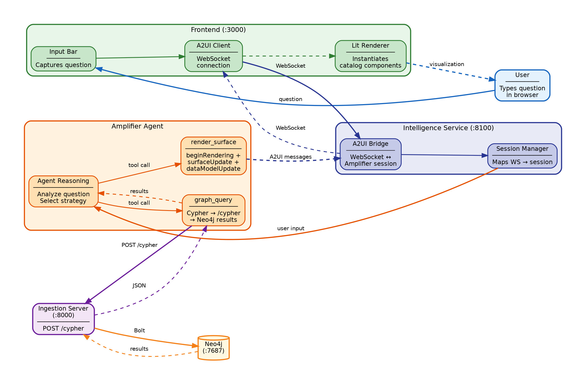
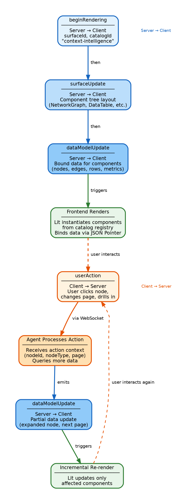
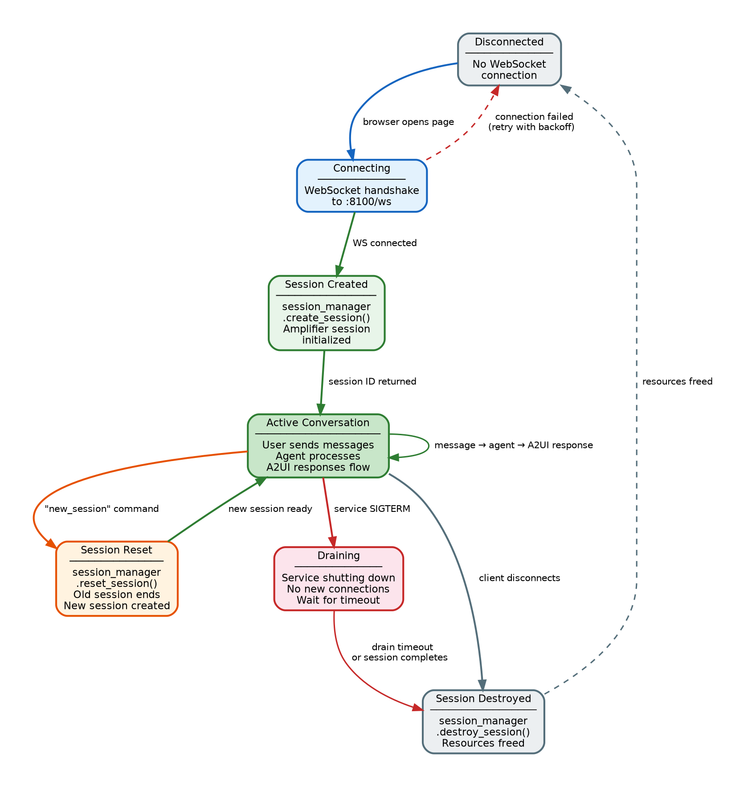
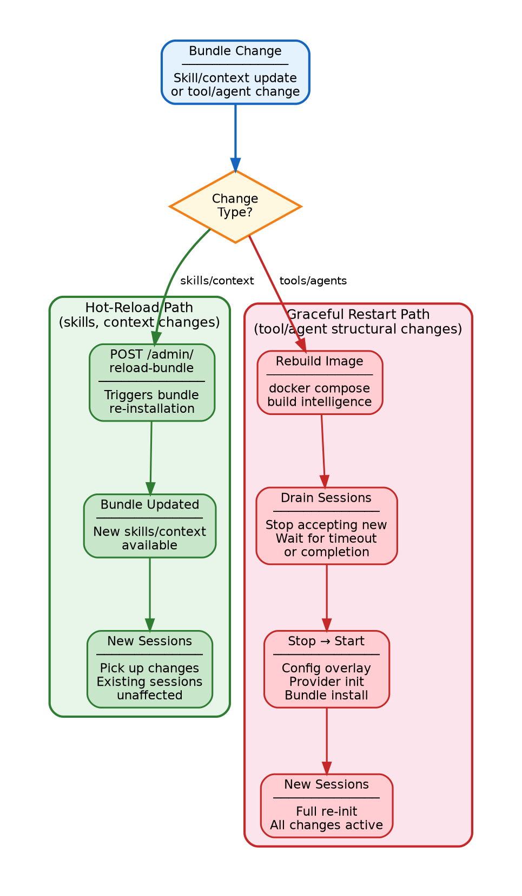
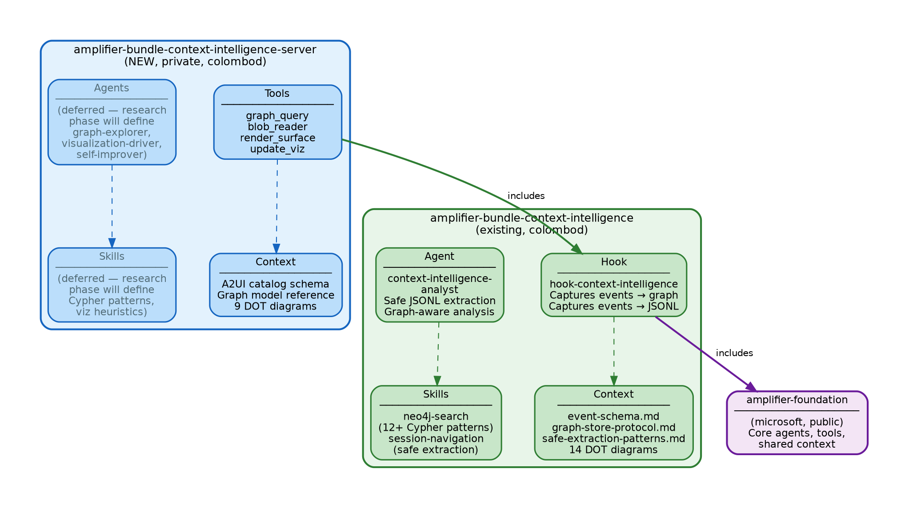
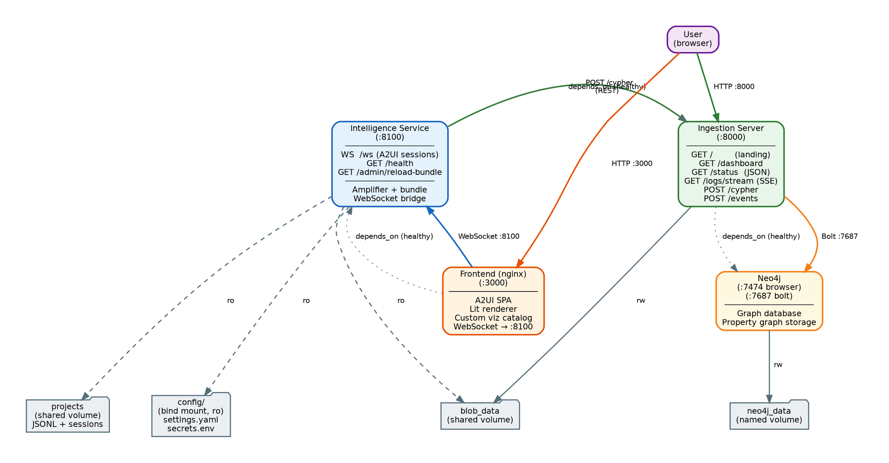
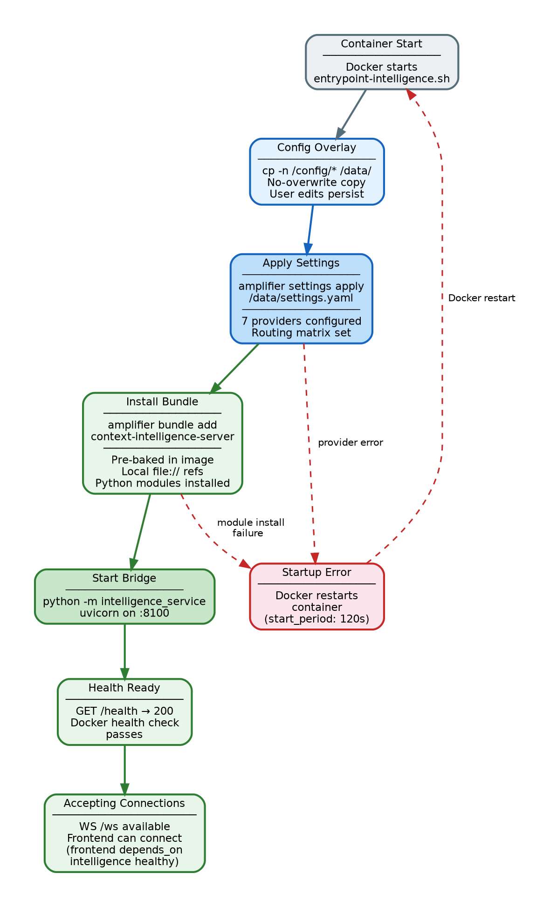
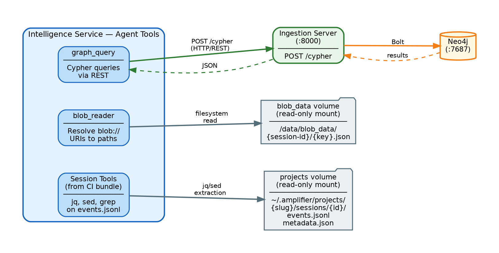

# Exploration System Phase 3: Server Bundle Skeleton + DOT Files

> **Execution:** Use the subagent-driven-development workflow to implement this plan.

**Goal:** Create the complete `amplifier-bundle-context-intelligence-server` bundle skeleton with tool stubs, context files, and all DOT architecture documentation files.

**Architecture:** The server bundle follows the established Amplifier bundle pattern: `bundle.md` with YAML frontmatter includes the existing `context-intelligence` bundle (for the hook and analyst agent) and references its own behavior YAML. The behavior YAML declares 4 tool modules (graph_query, blob_reader, render_surface, update_viz) as stubs — each is a proper Python package with `mount.py`, `tool.py`, and tests, but `execute()` returns a placeholder result. Context files provide the A2UI catalog schema and graph model reference. Nine DOT files document system architecture and operational flows in valid Graphviz format. Agents, skills, and tool implementations are deferred to the research phase.

**Tech Stack:** Python 3.11+, hatchling, uv, pytest + pytest-asyncio, YAML, JSON Schema, Graphviz DOT language

---

## Working Directories

**Server bundle** (tasks 1–10) — all paths relative to:

```bash
cd /home/dicolomb/amplifier-context-intelligence/amplifier-bundle-context-intelligence-server
```

**Main project** (task 11 only) — system architecture DOTs go in:

```bash
cd /home/dicolomb/amplifier-context-intelligence/amplifier-context-intelligence
```

Verify the feature branch is active in the main project:

```bash
cd /home/dicolomb/amplifier-context-intelligence/amplifier-context-intelligence
git branch --show-current
# Expected: feat/exploration-system
```

## Prerequisites

Phase 1 and Phase 2 plans exist. The server bundle repo exists with only `README.md` and `.git`:

```bash
ls /home/dicolomb/amplifier-context-intelligence/amplifier-bundle-context-intelligence-server/
# Expected: .git  README.md
```

## A2UI v0.8 Protocol Note

The design document uses v0.9 names (`createSurface`, `updateComponents`, `updateDataModel`). The actual A2UI v0.8 stable names are:

| Design doc name | Actual v0.8 name | Direction |
|---|---|---|
| `createSurface` | `beginRendering` | Server → Client |
| `updateComponents` | `surfaceUpdate` | Server → Client |
| `updateDataModel` | `dataModelUpdate` | Server → Client |

This plan uses the correct v0.8 names in tool descriptions and DOT files.

---

### Task 1: Bundle Skeleton

**Files:**
- Update: `README.md`
- Create: `bundle.md`
- Create: `.gitignore`
- Create directories: `behaviors/`, `modules/`, `context/`, `context/dot/`

No TDD for boilerplate scaffolding.

**Step 1: Create directory structure**

```bash
cd /home/dicolomb/amplifier-context-intelligence/amplifier-bundle-context-intelligence-server
mkdir -p behaviors modules context/dot
```

**Step 2: Create `bundle.md`**

This follows the exact pattern from the existing `amplifier-bundle-context-intelligence/bundle.md`. The `includes:` section pulls in the existing context-intelligence bundle (for hook + analyst agent + skills) and references this bundle's own behavior YAML.

```markdown
---
bundle:
  name: context-intelligence-server
  version: 0.1.0
  description: >
    Server-side intelligence bundle for the context-intelligence
    exploration system — agents, tools, and A2UI rendering for
    AI-driven graph exploration.

includes:
  - bundle: git+https://github.com/colombod/amplifier-bundle-context-intelligence@main
  - bundle: context-intelligence-server:behaviors/context-intelligence-server

---

# Context Intelligence Server

---

@context-intelligence:context/shared/common-system-base.md
```

**Step 3: Create `.gitignore`**

```gitignore
__pycache__/
*.pyc
*.pyo
.venv/
*.egg-info/
dist/
build/
.pytest_cache/
.ruff_cache/
.mypy_cache/
*.lock
```

**Step 4: Update `README.md`**

```markdown
# amplifier-bundle-context-intelligence-server

Server-side intelligence bundle for the context-intelligence exploration system — agents, tools, skills, and A2UI rendering for AI-driven graph exploration.

## Overview

This bundle provides the AI intelligence layer for the context-intelligence exploration system. It includes tools for querying the Neo4j graph, reading blob data, and rendering A2UI visualizations. It depends on `amplifier-bundle-context-intelligence` for the event capture hook and analyst agent.

## Bundle Dependency Chain

```
context-intelligence-server (this bundle)
├── includes: context-intelligence (existing)
│   ├── hook-context-intelligence (captures own events → graph)
│   ├── context-intelligence-analyst agent
│   └── skills: neo4j-search, session-navigation
├── tools: graph_query, blob_reader, render_surface, update_viz
├── agents: (deferred — research phase)
├── skills: (deferred — research phase)
└── context: A2UI catalog schema, graph model reference
```

## Tools

| Tool | Purpose | Status |
|------|---------|--------|
| `graph_query` | Execute Cypher queries via ingestion server `/cypher` endpoint | Stub |
| `blob_reader` | Resolve `context-intelligence-blob://` URIs to filesystem paths | Stub |
| `render_surface` | Emit A2UI `beginRendering` + `surfaceUpdate` messages | Stub |
| `update_viz` | Emit A2UI `dataModelUpdate` for incremental visualization updates | Stub |

## Installation

```bash
amplifier bundle add git+https://github.com/colombod/amplifier-bundle-context-intelligence-server@main --app
```

## Development

Each tool module is an independent Python package:

```bash
cd modules/tool-graph-query
uv sync --dev
uv run pytest tests/ -v
```

## License

MIT
```

**Step 5: Commit**

```bash
cd /home/dicolomb/amplifier-context-intelligence/amplifier-bundle-context-intelligence-server
git add bundle.md .gitignore README.md behaviors/ modules/ context/
git commit -m "feat: bundle skeleton — bundle.md, directories, README"
```

---

### Task 2: Behavior YAML

**Files:**
- Create: `behaviors/context-intelligence-server.yaml`

This follows the pattern from `amplifier-bundle-context-intelligence/behaviors/context-intelligence.yaml`. The server bundle's behavior declares 4 tool modules. Agents and skills are deferred.

**Step 1: Create `behaviors/context-intelligence-server.yaml`**

```yaml
# context-intelligence-server behavior v0.1.0
# Server-side intelligence tools for A2UI-driven graph exploration.
# Agents and skills are deferred to the research phase.

tools:
  - module: tool-graph-query
    source: git+https://github.com/colombod/amplifier-bundle-context-intelligence-server@main#subdirectory=modules/tool-graph-query
    config:
      ingestion_server_url: '${INGESTION_SERVER_URL:http://context-intelligence-server:8000}'
      default_limit: 200

  - module: tool-blob-reader
    source: git+https://github.com/colombod/amplifier-bundle-context-intelligence-server@main#subdirectory=modules/tool-blob-reader
    config:
      blob_data_path: '${BLOB_DATA_PATH:/data/blob_data}'

  - module: tool-render-surface
    source: git+https://github.com/colombod/amplifier-bundle-context-intelligence-server@main#subdirectory=modules/tool-render-surface
    config:
      catalog_id: 'context-intelligence'

  - module: tool-update-viz
    source: git+https://github.com/colombod/amplifier-bundle-context-intelligence-server@main#subdirectory=modules/tool-update-viz
    config: {}

# agents:
#   Deferred to the research phase. Will include:
#   - graph-explorer agent
#   - visualization-driver agent
#   - self-improver agent
#   include:
#     - context-intelligence-server:agents/graph-explorer
```

**Step 2: Commit**

```bash
cd /home/dicolomb/amplifier-context-intelligence/amplifier-bundle-context-intelligence-server
git add behaviors/context-intelligence-server.yaml
git commit -m "feat: behavior YAML with 4 tool module declarations"
```

---

### Task 3: Tool Stub — graph_query

**Files:**
- Create: `modules/tool-graph-query/pyproject.toml`
- Create: `modules/tool-graph-query/amplifier_module_tool_graph_query/__init__.py`
- Create: `modules/tool-graph-query/amplifier_module_tool_graph_query/mount.py`
- Create: `modules/tool-graph-query/amplifier_module_tool_graph_query/tool.py`
- Create: `modules/tool-graph-query/tests/__init__.py`
- Create: `modules/tool-graph-query/tests/conftest.py`
- Create: `modules/tool-graph-query/tests/test_tool.py`

This is the first tool module. It sets the pattern for all 4 tool stubs.

**Step 1: Create directory structure**

```bash
cd /home/dicolomb/amplifier-context-intelligence/amplifier-bundle-context-intelligence-server
mkdir -p modules/tool-graph-query/amplifier_module_tool_graph_query
mkdir -p modules/tool-graph-query/tests
```

**Step 2: Create `modules/tool-graph-query/pyproject.toml`**

Follows the pattern from `amplifier-bundle-context-intelligence/modules/hook-context-intelligence/pyproject.toml`.

```toml
[project]
name = "amplifier-module-tool-graph-query"
version = "0.1.0"
description = "Graph query tool — execute Cypher queries against the context-intelligence Neo4j graph"
requires-python = ">=3.11"
license = "MIT"

dependencies = []

[project.entry-points."amplifier.modules"]
tool-graph-query = "amplifier_module_tool_graph_query:mount"

[build-system]
requires = ["hatchling"]
build-backend = "hatchling.build"

[tool.uv]
package = true

[tool.hatch.build.targets.wheel]
packages = ["amplifier_module_tool_graph_query"]

[dependency-groups]
dev = [
    "pytest>=8.0",
    "pytest-asyncio>=0.24",
    "pyyaml>=6.0",
]

[tool.pytest.ini_options]
asyncio_mode = "auto"
asyncio_default_fixture_loop_scope = "function"

[tool.ruff]
target-version = "py311"
line-length = 100
```

**Step 3: Create `modules/tool-graph-query/amplifier_module_tool_graph_query/__init__.py`**

```python
"""Amplifier module: graph_query tool.

Executes Cypher queries against the context-intelligence Neo4j graph
via the ingestion server's /cypher endpoint.
"""

from __future__ import annotations

from .mount import mount  # noqa: F401

__amplifier_module_type__ = "tool"
```

**Step 4: Create `modules/tool-graph-query/amplifier_module_tool_graph_query/mount.py`**

```python
"""Mount function for the graph_query tool module."""

from __future__ import annotations

import logging
from typing import Any

logger = logging.getLogger(__name__)


async def mount(coordinator: Any, config: dict[str, Any] | None = None) -> None:
    """Mount the graph_query tool on the coordinator.

    Args:
        coordinator: The Amplifier module coordinator.
        config: Optional configuration with ingestion_server_url and default_limit.
    """
    from .tool import GraphQueryTool

    config = config or {}
    tool = GraphQueryTool(config)
    await coordinator.mount("tools", tool, name=tool.name)
    logger.info("Mounted graph_query tool (stub)")
```

**Step 5: Create `modules/tool-graph-query/amplifier_module_tool_graph_query/tool.py`**

```python
"""GraphQueryTool — execute Cypher queries against the Neo4j graph."""

from __future__ import annotations

from typing import Any


class GraphQueryTool:
    """Execute Cypher queries against the context-intelligence Neo4j graph.

    Queries are sent to the ingestion server's POST /cypher endpoint,
    which proxies them to Neo4j via Bolt. The tool enforces a configurable
    row limit (default 200) to prevent runaway queries.

    Status: STUB — awaiting research phase for implementation.
    """

    name = "graph_query"

    def __init__(self, config: dict[str, Any] | None = None) -> None:
        self._config = config or {}
        self._ingestion_url = self._config.get(
            "ingestion_server_url", "http://context-intelligence-server:8000"
        )
        self._default_limit = self._config.get("default_limit", 200)

    @property
    def description(self) -> str:
        return (
            "Execute a Cypher query against the context-intelligence Neo4j graph. "
            "Queries are sent to the ingestion server's /cypher endpoint. "
            "Results are limited to prevent runaway queries (default: 200 rows). "
            "Use parameterized queries when possible."
        )

    @property
    def input_schema(self) -> dict[str, Any]:
        return {
            "type": "object",
            "properties": {
                "query": {
                    "type": "string",
                    "description": "Cypher query to execute against the Neo4j graph",
                },
                "params": {
                    "type": "object",
                    "description": "Query parameters for parameterized Cypher (e.g. {session_id: 'abc'})",
                },
                "limit": {
                    "type": "integer",
                    "description": f"Maximum number of result rows (default: {self._default_limit})",
                },
            },
            "required": ["query"],
        }

    async def execute(self, input: dict[str, Any]) -> dict[str, Any]:
        """Stub: returns placeholder result.

        Will be implemented during the research phase to:
        1. POST the Cypher query to the ingestion server's /cypher endpoint
        2. Apply the row limit
        3. Return structured results
        """
        return {
            "success": False,
            "output": None,
            "error": {
                "message": "Tool not yet implemented — awaiting research phase.",
                "tool": "graph_query",
            },
        }
```

**Step 6: Create `modules/tool-graph-query/tests/__init__.py`**

```python
```

(Empty file.)

**Step 7: Create `modules/tool-graph-query/tests/conftest.py`**

This MockCoordinator is reused across all tool module tests.

```python
"""Shared test fixtures for tool module tests."""

from __future__ import annotations

from typing import Any

import pytest


class MockCoordinator:
    """Minimal coordinator mock for testing tool mount and registration."""

    def __init__(self) -> None:
        self.mounted: dict[str, dict[str, Any]] = {}

    async def mount(self, category: str, obj: Any, *, name: str) -> None:
        if category not in self.mounted:
            self.mounted[category] = {}
        self.mounted[category][name] = obj


@pytest.fixture
def coordinator() -> MockCoordinator:
    """A fresh MockCoordinator for each test."""
    return MockCoordinator()
```

**Step 8: Write failing test — create `modules/tool-graph-query/tests/test_tool.py`**

```python
"""Tests for the graph_query tool stub."""

from __future__ import annotations

from tests.conftest import MockCoordinator


class TestGraphQueryMount:
    """Verify mount() registers the tool correctly."""

    async def test_mount_registers_tool(self, coordinator: MockCoordinator) -> None:
        from amplifier_module_tool_graph_query import mount

        await mount(coordinator)
        assert "graph_query" in coordinator.mounted.get("tools", {})

    async def test_mount_with_config(self, coordinator: MockCoordinator) -> None:
        from amplifier_module_tool_graph_query import mount

        config = {"ingestion_server_url": "http://localhost:8000", "default_limit": 100}
        await mount(coordinator, config)
        tool = coordinator.mounted["tools"]["graph_query"]
        assert tool._default_limit == 100


class TestGraphQueryTool:
    """Verify tool properties and stub behavior."""

    async def test_name(self) -> None:
        from amplifier_module_tool_graph_query.tool import GraphQueryTool

        tool = GraphQueryTool()
        assert tool.name == "graph_query"

    async def test_description_is_nonempty(self) -> None:
        from amplifier_module_tool_graph_query.tool import GraphQueryTool

        tool = GraphQueryTool()
        assert len(tool.description) > 20

    async def test_input_schema_has_required_query(self) -> None:
        from amplifier_module_tool_graph_query.tool import GraphQueryTool

        tool = GraphQueryTool()
        schema = tool.input_schema
        assert schema["type"] == "object"
        assert "query" in schema["properties"]
        assert "query" in schema["required"]

    async def test_input_schema_has_params_and_limit(self) -> None:
        from amplifier_module_tool_graph_query.tool import GraphQueryTool

        tool = GraphQueryTool()
        schema = tool.input_schema
        assert "params" in schema["properties"]
        assert "limit" in schema["properties"]

    async def test_execute_returns_placeholder(self) -> None:
        from amplifier_module_tool_graph_query.tool import GraphQueryTool

        tool = GraphQueryTool()
        result = await tool.execute({"query": "MATCH (n) RETURN n LIMIT 5"})
        assert result["success"] is False
        assert "not yet implemented" in result["error"]["message"]
        assert result["error"]["tool"] == "graph_query"


class TestModuleMetadata:
    """Verify module-level metadata."""

    def test_module_type_is_tool(self) -> None:
        import amplifier_module_tool_graph_query

        assert amplifier_module_tool_graph_query.__amplifier_module_type__ == "tool"
```

**Step 9: Set up venv and run tests to verify they fail**

```bash
cd /home/dicolomb/amplifier-context-intelligence/amplifier-bundle-context-intelligence-server/modules/tool-graph-query
uv sync --dev
uv run pytest tests/ -v
```

Expected: All 8 tests PASS (since we wrote implementation and tests together for stubs — the "fail" phase is trivially satisfied because the tool explicitly returns a failure placeholder).

**Step 10: Commit**

```bash
cd /home/dicolomb/amplifier-context-intelligence/amplifier-bundle-context-intelligence-server
git add modules/tool-graph-query/
git commit -m "feat: tool stub — graph_query with mount, schema, and tests"
```

---

### Task 4: Tool Stub — blob_reader

**Files:**
- Create: `modules/tool-blob-reader/pyproject.toml`
- Create: `modules/tool-blob-reader/amplifier_module_tool_blob_reader/__init__.py`
- Create: `modules/tool-blob-reader/amplifier_module_tool_blob_reader/mount.py`
- Create: `modules/tool-blob-reader/amplifier_module_tool_blob_reader/tool.py`
- Create: `modules/tool-blob-reader/tests/__init__.py`
- Create: `modules/tool-blob-reader/tests/conftest.py`
- Create: `modules/tool-blob-reader/tests/test_tool.py`

Same structure as Task 3. Only `tool.py` and `test_tool.py` have unique content.

**Step 1: Create directory structure**

```bash
cd /home/dicolomb/amplifier-context-intelligence/amplifier-bundle-context-intelligence-server
mkdir -p modules/tool-blob-reader/amplifier_module_tool_blob_reader
mkdir -p modules/tool-blob-reader/tests
```

**Step 2: Create `modules/tool-blob-reader/pyproject.toml`**

```toml
[project]
name = "amplifier-module-tool-blob-reader"
version = "0.1.0"
description = "Blob reader tool — resolve context-intelligence-blob:// URIs to filesystem paths"
requires-python = ">=3.11"
license = "MIT"

dependencies = []

[project.entry-points."amplifier.modules"]
tool-blob-reader = "amplifier_module_tool_blob_reader:mount"

[build-system]
requires = ["hatchling"]
build-backend = "hatchling.build"

[tool.uv]
package = true

[tool.hatch.build.targets.wheel]
packages = ["amplifier_module_tool_blob_reader"]

[dependency-groups]
dev = [
    "pytest>=8.0",
    "pytest-asyncio>=0.24",
]

[tool.pytest.ini_options]
asyncio_mode = "auto"
asyncio_default_fixture_loop_scope = "function"

[tool.ruff]
target-version = "py311"
line-length = 100
```

**Step 3: Create `modules/tool-blob-reader/amplifier_module_tool_blob_reader/__init__.py`**

```python
"""Amplifier module: blob_reader tool.

Resolves context-intelligence-blob:// URIs to filesystem paths
and extracts specified fields from blob JSON files.
"""

from __future__ import annotations

from .mount import mount  # noqa: F401

__amplifier_module_type__ = "tool"
```

**Step 4: Create `modules/tool-blob-reader/amplifier_module_tool_blob_reader/mount.py`**

```python
"""Mount function for the blob_reader tool module."""

from __future__ import annotations

import logging
from typing import Any

logger = logging.getLogger(__name__)


async def mount(coordinator: Any, config: dict[str, Any] | None = None) -> None:
    """Mount the blob_reader tool on the coordinator.

    Args:
        coordinator: The Amplifier module coordinator.
        config: Optional configuration with blob_data_path.
    """
    from .tool import BlobReaderTool

    config = config or {}
    tool = BlobReaderTool(config)
    await coordinator.mount("tools", tool, name=tool.name)
    logger.info("Mounted blob_reader tool (stub)")
```

**Step 5: Create `modules/tool-blob-reader/amplifier_module_tool_blob_reader/tool.py`**

```python
"""BlobReaderTool — resolve context-intelligence-blob:// URIs to filesystem paths."""

from __future__ import annotations

from typing import Any


class BlobReaderTool:
    """Resolve context-intelligence-blob:// URIs to filesystem paths.

    Blob URIs are produced by the context-intelligence hook when large event
    fields are offloaded to blob storage. This tool resolves those URIs to
    actual file paths on the shared blob_data volume and optionally extracts
    specific JSON fields.

    Both the ingestion server and intelligence service must mount the
    blob_data volume at the same path for URI resolution to work.

    Status: STUB — awaiting research phase for implementation.
    """

    name = "blob_reader"

    def __init__(self, config: dict[str, Any] | None = None) -> None:
        self._config = config or {}
        self._blob_data_path = self._config.get("blob_data_path", "/data/blob_data")

    @property
    def description(self) -> str:
        return (
            "Resolve a context-intelligence-blob:// URI to a filesystem path and "
            "optionally extract specific JSON fields from the blob. "
            "Use this when the graph contains blob references instead of inline data. "
            "NEVER read the full blob into context — always specify extract_fields."
        )

    @property
    def input_schema(self) -> dict[str, Any]:
        return {
            "type": "object",
            "properties": {
                "uri": {
                    "type": "string",
                    "description": (
                        "context-intelligence-blob:// URI to resolve "
                        "(e.g. context-intelligence-blob://session-id/blob-key)"
                    ),
                },
                "extract_fields": {
                    "type": "array",
                    "items": {"type": "string"},
                    "description": (
                        "Specific JSON fields to extract from the blob. "
                        "Always specify this to avoid loading full blob into context."
                    ),
                },
            },
            "required": ["uri"],
        }

    async def execute(self, input: dict[str, Any]) -> dict[str, Any]:
        """Stub: returns placeholder result.

        Will be implemented during the research phase to:
        1. Parse the context-intelligence-blob:// URI
        2. Resolve to a filesystem path under blob_data_path
        3. Optionally extract specific fields via jq-like access
        4. Return the extracted data (never the full blob)
        """
        return {
            "success": False,
            "output": None,
            "error": {
                "message": "Tool not yet implemented — awaiting research phase.",
                "tool": "blob_reader",
            },
        }
```

**Step 6: Create `modules/tool-blob-reader/tests/__init__.py`**

```python
```

(Empty file.)

**Step 7: Create `modules/tool-blob-reader/tests/conftest.py`**

```python
"""Shared test fixtures for tool module tests."""

from __future__ import annotations

from typing import Any

import pytest


class MockCoordinator:
    """Minimal coordinator mock for testing tool mount and registration."""

    def __init__(self) -> None:
        self.mounted: dict[str, dict[str, Any]] = {}

    async def mount(self, category: str, obj: Any, *, name: str) -> None:
        if category not in self.mounted:
            self.mounted[category] = {}
        self.mounted[category][name] = obj


@pytest.fixture
def coordinator() -> MockCoordinator:
    """A fresh MockCoordinator for each test."""
    return MockCoordinator()
```

**Step 8: Create `modules/tool-blob-reader/tests/test_tool.py`**

```python
"""Tests for the blob_reader tool stub."""

from __future__ import annotations

from tests.conftest import MockCoordinator


class TestBlobReaderMount:
    """Verify mount() registers the tool correctly."""

    async def test_mount_registers_tool(self, coordinator: MockCoordinator) -> None:
        from amplifier_module_tool_blob_reader import mount

        await mount(coordinator)
        assert "blob_reader" in coordinator.mounted.get("tools", {})

    async def test_mount_with_config(self, coordinator: MockCoordinator) -> None:
        from amplifier_module_tool_blob_reader import mount

        config = {"blob_data_path": "/custom/blob/path"}
        await mount(coordinator, config)
        tool = coordinator.mounted["tools"]["blob_reader"]
        assert tool._blob_data_path == "/custom/blob/path"


class TestBlobReaderTool:
    """Verify tool properties and stub behavior."""

    async def test_name(self) -> None:
        from amplifier_module_tool_blob_reader.tool import BlobReaderTool

        tool = BlobReaderTool()
        assert tool.name == "blob_reader"

    async def test_description_is_nonempty(self) -> None:
        from amplifier_module_tool_blob_reader.tool import BlobReaderTool

        tool = BlobReaderTool()
        assert len(tool.description) > 20

    async def test_input_schema_has_required_uri(self) -> None:
        from amplifier_module_tool_blob_reader.tool import BlobReaderTool

        tool = BlobReaderTool()
        schema = tool.input_schema
        assert schema["type"] == "object"
        assert "uri" in schema["properties"]
        assert "uri" in schema["required"]

    async def test_input_schema_has_extract_fields(self) -> None:
        from amplifier_module_tool_blob_reader.tool import BlobReaderTool

        tool = BlobReaderTool()
        schema = tool.input_schema
        assert "extract_fields" in schema["properties"]
        assert schema["properties"]["extract_fields"]["type"] == "array"

    async def test_execute_returns_placeholder(self) -> None:
        from amplifier_module_tool_blob_reader.tool import BlobReaderTool

        tool = BlobReaderTool()
        result = await tool.execute({"uri": "context-intelligence-blob://sess/key"})
        assert result["success"] is False
        assert "not yet implemented" in result["error"]["message"]
        assert result["error"]["tool"] == "blob_reader"


class TestModuleMetadata:
    """Verify module-level metadata."""

    def test_module_type_is_tool(self) -> None:
        import amplifier_module_tool_blob_reader

        assert amplifier_module_tool_blob_reader.__amplifier_module_type__ == "tool"
```

**Step 9: Set up venv and run tests**

```bash
cd /home/dicolomb/amplifier-context-intelligence/amplifier-bundle-context-intelligence-server/modules/tool-blob-reader
uv sync --dev
uv run pytest tests/ -v
```

Expected: All 7 tests PASS.

**Step 10: Commit**

```bash
cd /home/dicolomb/amplifier-context-intelligence/amplifier-bundle-context-intelligence-server
git add modules/tool-blob-reader/
git commit -m "feat: tool stub — blob_reader with mount, schema, and tests"
```

---

### Task 5: Tool Stub — render_surface

**Files:**
- Create: `modules/tool-render-surface/pyproject.toml`
- Create: `modules/tool-render-surface/amplifier_module_tool_render_surface/__init__.py`
- Create: `modules/tool-render-surface/amplifier_module_tool_render_surface/mount.py`
- Create: `modules/tool-render-surface/amplifier_module_tool_render_surface/tool.py`
- Create: `modules/tool-render-surface/tests/__init__.py`
- Create: `modules/tool-render-surface/tests/conftest.py`
- Create: `modules/tool-render-surface/tests/test_tool.py`

**Step 1: Create directory structure**

```bash
cd /home/dicolomb/amplifier-context-intelligence/amplifier-bundle-context-intelligence-server
mkdir -p modules/tool-render-surface/amplifier_module_tool_render_surface
mkdir -p modules/tool-render-surface/tests
```

**Step 2: Create `modules/tool-render-surface/pyproject.toml`**

```toml
[project]
name = "amplifier-module-tool-render-surface"
version = "0.1.0"
description = "Render surface tool — emit A2UI beginRendering + surfaceUpdate messages"
requires-python = ">=3.11"
license = "MIT"

dependencies = []

[project.entry-points."amplifier.modules"]
tool-render-surface = "amplifier_module_tool_render_surface:mount"

[build-system]
requires = ["hatchling"]
build-backend = "hatchling.build"

[tool.uv]
package = true

[tool.hatch.build.targets.wheel]
packages = ["amplifier_module_tool_render_surface"]

[dependency-groups]
dev = [
    "pytest>=8.0",
    "pytest-asyncio>=0.24",
]

[tool.pytest.ini_options]
asyncio_mode = "auto"
asyncio_default_fixture_loop_scope = "function"

[tool.ruff]
target-version = "py311"
line-length = 100
```

**Step 3: Create `modules/tool-render-surface/amplifier_module_tool_render_surface/__init__.py`**

```python
"""Amplifier module: render_surface tool.

Emits A2UI beginRendering + surfaceUpdate messages to create
a new visualization surface with components and initial data.
"""

from __future__ import annotations

from .mount import mount  # noqa: F401

__amplifier_module_type__ = "tool"
```

**Step 4: Create `modules/tool-render-surface/amplifier_module_tool_render_surface/mount.py`**

```python
"""Mount function for the render_surface tool module."""

from __future__ import annotations

import logging
from typing import Any

logger = logging.getLogger(__name__)


async def mount(coordinator: Any, config: dict[str, Any] | None = None) -> None:
    """Mount the render_surface tool on the coordinator.

    Args:
        coordinator: The Amplifier module coordinator.
        config: Optional configuration with catalog_id.
    """
    from .tool import RenderSurfaceTool

    config = config or {}
    tool = RenderSurfaceTool(config)
    await coordinator.mount("tools", tool, name=tool.name)
    logger.info("Mounted render_surface tool (stub)")
```

**Step 5: Create `modules/tool-render-surface/amplifier_module_tool_render_surface/tool.py`**

```python
"""RenderSurfaceTool — emit A2UI beginRendering + surfaceUpdate messages."""

from __future__ import annotations

from typing import Any


class RenderSurfaceTool:
    """Create a new A2UI visualization surface with components and data.

    This tool emits two A2UI v0.8 messages in sequence:
    1. beginRendering — creates the surface with a catalog reference
    2. surfaceUpdate — sets the component tree layout and initial data model

    The agent uses this tool when it needs to show a new visualization
    to the user (e.g., a graph view, chart, or table of query results).

    Status: STUB — awaiting research phase for implementation.
    """

    name = "render_surface"

    def __init__(self, config: dict[str, Any] | None = None) -> None:
        self._config = config or {}
        self._catalog_id = self._config.get("catalog_id", "context-intelligence")

    @property
    def description(self) -> str:
        return (
            "Create a new A2UI visualization surface. Emits beginRendering to initialize "
            "the surface, then surfaceUpdate to set the component layout and data model. "
            "Use this when showing NEW visualizations. For updating existing surfaces, "
            "use update_viz instead. Available components: NetworkGraph, TimeseriesChart, "
            "StatChart, DotDiagram, DataTable, MetricCard."
        )

    @property
    def input_schema(self) -> dict[str, Any]:
        return {
            "type": "object",
            "properties": {
                "surface_id": {
                    "type": "string",
                    "description": "Unique identifier for this surface",
                },
                "title": {
                    "type": "string",
                    "description": "Human-readable title for the surface",
                },
                "components": {
                    "type": "array",
                    "description": (
                        "Component tree defining the surface layout. "
                        "Each component has: type (e.g. 'NetworkGraph'), "
                        "properties (component-specific config), "
                        "and data_path (JSON Pointer to data model)."
                    ),
                    "items": {
                        "type": "object",
                        "properties": {
                            "type": {"type": "string"},
                            "properties": {"type": "object"},
                            "data_path": {"type": "string"},
                        },
                        "required": ["type"],
                    },
                },
                "data": {
                    "type": "object",
                    "description": "Initial data model for bound values in the components",
                },
            },
            "required": ["surface_id", "components"],
        }

    async def execute(self, input: dict[str, Any]) -> dict[str, Any]:
        """Stub: returns placeholder result.

        Will be implemented during the research phase to:
        1. Construct a beginRendering A2UI message with surface_id and catalog_id
        2. Construct a surfaceUpdate message with the component tree
        3. Optionally construct a dataModelUpdate with initial data
        4. Emit all messages via the coordinator's A2UI channel
        """
        return {
            "success": False,
            "output": None,
            "error": {
                "message": "Tool not yet implemented — awaiting research phase.",
                "tool": "render_surface",
            },
        }
```

**Step 6: Create `modules/tool-render-surface/tests/__init__.py`**

```python
```

(Empty file.)

**Step 7: Create `modules/tool-render-surface/tests/conftest.py`**

```python
"""Shared test fixtures for tool module tests."""

from __future__ import annotations

from typing import Any

import pytest


class MockCoordinator:
    """Minimal coordinator mock for testing tool mount and registration."""

    def __init__(self) -> None:
        self.mounted: dict[str, dict[str, Any]] = {}

    async def mount(self, category: str, obj: Any, *, name: str) -> None:
        if category not in self.mounted:
            self.mounted[category] = {}
        self.mounted[category][name] = obj


@pytest.fixture
def coordinator() -> MockCoordinator:
    """A fresh MockCoordinator for each test."""
    return MockCoordinator()
```

**Step 8: Create `modules/tool-render-surface/tests/test_tool.py`**

```python
"""Tests for the render_surface tool stub."""

from __future__ import annotations

from tests.conftest import MockCoordinator


class TestRenderSurfaceMount:
    """Verify mount() registers the tool correctly."""

    async def test_mount_registers_tool(self, coordinator: MockCoordinator) -> None:
        from amplifier_module_tool_render_surface import mount

        await mount(coordinator)
        assert "render_surface" in coordinator.mounted.get("tools", {})

    async def test_mount_with_config(self, coordinator: MockCoordinator) -> None:
        from amplifier_module_tool_render_surface import mount

        config = {"catalog_id": "custom-catalog"}
        await mount(coordinator, config)
        tool = coordinator.mounted["tools"]["render_surface"]
        assert tool._catalog_id == "custom-catalog"


class TestRenderSurfaceTool:
    """Verify tool properties and stub behavior."""

    async def test_name(self) -> None:
        from amplifier_module_tool_render_surface.tool import RenderSurfaceTool

        tool = RenderSurfaceTool()
        assert tool.name == "render_surface"

    async def test_description_mentions_a2ui(self) -> None:
        from amplifier_module_tool_render_surface.tool import RenderSurfaceTool

        tool = RenderSurfaceTool()
        assert "A2UI" in tool.description
        assert "beginRendering" in tool.description

    async def test_input_schema_has_required_fields(self) -> None:
        from amplifier_module_tool_render_surface.tool import RenderSurfaceTool

        tool = RenderSurfaceTool()
        schema = tool.input_schema
        assert schema["type"] == "object"
        assert "surface_id" in schema["properties"]
        assert "components" in schema["properties"]
        assert set(schema["required"]) == {"surface_id", "components"}

    async def test_input_schema_components_is_array(self) -> None:
        from amplifier_module_tool_render_surface.tool import RenderSurfaceTool

        tool = RenderSurfaceTool()
        schema = tool.input_schema
        assert schema["properties"]["components"]["type"] == "array"

    async def test_execute_returns_placeholder(self) -> None:
        from amplifier_module_tool_render_surface.tool import RenderSurfaceTool

        tool = RenderSurfaceTool()
        result = await tool.execute({
            "surface_id": "test-surface",
            "components": [{"type": "MetricCard"}],
        })
        assert result["success"] is False
        assert "not yet implemented" in result["error"]["message"]
        assert result["error"]["tool"] == "render_surface"


class TestModuleMetadata:
    """Verify module-level metadata."""

    def test_module_type_is_tool(self) -> None:
        import amplifier_module_tool_render_surface

        assert amplifier_module_tool_render_surface.__amplifier_module_type__ == "tool"
```

**Step 9: Set up venv and run tests**

```bash
cd /home/dicolomb/amplifier-context-intelligence/amplifier-bundle-context-intelligence-server/modules/tool-render-surface
uv sync --dev
uv run pytest tests/ -v
```

Expected: All 7 tests PASS.

**Step 10: Commit**

```bash
cd /home/dicolomb/amplifier-context-intelligence/amplifier-bundle-context-intelligence-server
git add modules/tool-render-surface/
git commit -m "feat: tool stub — render_surface with mount, schema, and tests"
```

---

### Task 6: Tool Stub — update_viz

**Files:**
- Create: `modules/tool-update-viz/pyproject.toml`
- Create: `modules/tool-update-viz/amplifier_module_tool_update_viz/__init__.py`
- Create: `modules/tool-update-viz/amplifier_module_tool_update_viz/mount.py`
- Create: `modules/tool-update-viz/amplifier_module_tool_update_viz/tool.py`
- Create: `modules/tool-update-viz/tests/__init__.py`
- Create: `modules/tool-update-viz/tests/conftest.py`
- Create: `modules/tool-update-viz/tests/test_tool.py`

**Step 1: Create directory structure**

```bash
cd /home/dicolomb/amplifier-context-intelligence/amplifier-bundle-context-intelligence-server
mkdir -p modules/tool-update-viz/amplifier_module_tool_update_viz
mkdir -p modules/tool-update-viz/tests
```

**Step 2: Create `modules/tool-update-viz/pyproject.toml`**

```toml
[project]
name = "amplifier-module-tool-update-viz"
version = "0.1.0"
description = "Update viz tool — emit A2UI dataModelUpdate for incremental visualization updates"
requires-python = ">=3.11"
license = "MIT"

dependencies = []

[project.entry-points."amplifier.modules"]
tool-update-viz = "amplifier_module_tool_update_viz:mount"

[build-system]
requires = ["hatchling"]
build-backend = "hatchling.build"

[tool.uv]
package = true

[tool.hatch.build.targets.wheel]
packages = ["amplifier_module_tool_update_viz"]

[dependency-groups]
dev = [
    "pytest>=8.0",
    "pytest-asyncio>=0.24",
]

[tool.pytest.ini_options]
asyncio_mode = "auto"
asyncio_default_fixture_loop_scope = "function"

[tool.ruff]
target-version = "py311"
line-length = 100
```

**Step 3: Create `modules/tool-update-viz/amplifier_module_tool_update_viz/__init__.py`**

```python
"""Amplifier module: update_viz tool.

Emits A2UI dataModelUpdate messages for incremental visualization
updates — e.g., when a user drills into a node and the agent needs
to add data without rebuilding the entire surface.
"""

from __future__ import annotations

from .mount import mount  # noqa: F401

__amplifier_module_type__ = "tool"
```

**Step 4: Create `modules/tool-update-viz/amplifier_module_tool_update_viz/mount.py`**

```python
"""Mount function for the update_viz tool module."""

from __future__ import annotations

import logging
from typing import Any

logger = logging.getLogger(__name__)


async def mount(coordinator: Any, config: dict[str, Any] | None = None) -> None:
    """Mount the update_viz tool on the coordinator.

    Args:
        coordinator: The Amplifier module coordinator.
        config: Optional configuration (currently unused).
    """
    from .tool import UpdateVizTool

    config = config or {}
    tool = UpdateVizTool(config)
    await coordinator.mount("tools", tool, name=tool.name)
    logger.info("Mounted update_viz tool (stub)")
```

**Step 5: Create `modules/tool-update-viz/amplifier_module_tool_update_viz/tool.py`**

```python
"""UpdateVizTool — emit A2UI dataModelUpdate for incremental updates."""

from __future__ import annotations

from typing import Any


class UpdateVizTool:
    """Send incremental data and component updates to an existing A2UI surface.

    This tool emits A2UI v0.8 dataModelUpdate messages to update the data
    bound to components on an existing surface. Optionally, it can also emit
    surfaceUpdate to change the component tree layout.

    Use this when responding to user interactions (e.g., clicking a node to
    drill in) or when adding new data to an existing visualization.

    Status: STUB — awaiting research phase for implementation.
    """

    name = "update_viz"

    def __init__(self, config: dict[str, Any] | None = None) -> None:
        self._config = config or {}

    @property
    def description(self) -> str:
        return (
            "Update an existing A2UI visualization surface with new data or layout changes. "
            "Emits dataModelUpdate for data changes and optionally surfaceUpdate for "
            "component tree changes. Use this for incremental updates (drill-down, "
            "pagination, filter changes). For new surfaces, use render_surface instead."
        )

    @property
    def input_schema(self) -> dict[str, Any]:
        return {
            "type": "object",
            "properties": {
                "surface_id": {
                    "type": "string",
                    "description": "Target surface to update (must already exist)",
                },
                "data_updates": {
                    "type": "object",
                    "description": (
                        "Partial data model updates. Keys are JSON Pointer paths "
                        "into the data model, values are the new data. Only specified "
                        "paths are updated; unmentioned paths are preserved."
                    ),
                },
                "component_updates": {
                    "type": "array",
                    "description": (
                        "Optional component tree changes (e.g., add a new panel, "
                        "change a component's properties). Omit if only data changes."
                    ),
                    "items": {
                        "type": "object",
                        "properties": {
                            "type": {"type": "string"},
                            "properties": {"type": "object"},
                            "data_path": {"type": "string"},
                        },
                    },
                },
            },
            "required": ["surface_id", "data_updates"],
        }

    async def execute(self, input: dict[str, Any]) -> dict[str, Any]:
        """Stub: returns placeholder result.

        Will be implemented during the research phase to:
        1. Validate the target surface_id exists
        2. Construct a dataModelUpdate A2UI message with the partial updates
        3. Optionally construct a surfaceUpdate if component_updates is provided
        4. Emit messages via the coordinator's A2UI channel
        """
        return {
            "success": False,
            "output": None,
            "error": {
                "message": "Tool not yet implemented — awaiting research phase.",
                "tool": "update_viz",
            },
        }
```

**Step 6: Create `modules/tool-update-viz/tests/__init__.py`**

```python
```

(Empty file.)

**Step 7: Create `modules/tool-update-viz/tests/conftest.py`**

```python
"""Shared test fixtures for tool module tests."""

from __future__ import annotations

from typing import Any

import pytest


class MockCoordinator:
    """Minimal coordinator mock for testing tool mount and registration."""

    def __init__(self) -> None:
        self.mounted: dict[str, dict[str, Any]] = {}

    async def mount(self, category: str, obj: Any, *, name: str) -> None:
        if category not in self.mounted:
            self.mounted[category] = {}
        self.mounted[category][name] = obj


@pytest.fixture
def coordinator() -> MockCoordinator:
    """A fresh MockCoordinator for each test."""
    return MockCoordinator()
```

**Step 8: Create `modules/tool-update-viz/tests/test_tool.py`**

```python
"""Tests for the update_viz tool stub."""

from __future__ import annotations

from tests.conftest import MockCoordinator


class TestUpdateVizMount:
    """Verify mount() registers the tool correctly."""

    async def test_mount_registers_tool(self, coordinator: MockCoordinator) -> None:
        from amplifier_module_tool_update_viz import mount

        await mount(coordinator)
        assert "update_viz" in coordinator.mounted.get("tools", {})


class TestUpdateVizTool:
    """Verify tool properties and stub behavior."""

    async def test_name(self) -> None:
        from amplifier_module_tool_update_viz.tool import UpdateVizTool

        tool = UpdateVizTool()
        assert tool.name == "update_viz"

    async def test_description_mentions_incremental(self) -> None:
        from amplifier_module_tool_update_viz.tool import UpdateVizTool

        tool = UpdateVizTool()
        assert "incremental" in tool.description.lower() or "update" in tool.description.lower()

    async def test_input_schema_has_required_fields(self) -> None:
        from amplifier_module_tool_update_viz.tool import UpdateVizTool

        tool = UpdateVizTool()
        schema = tool.input_schema
        assert schema["type"] == "object"
        assert "surface_id" in schema["properties"]
        assert "data_updates" in schema["properties"]
        assert set(schema["required"]) == {"surface_id", "data_updates"}

    async def test_input_schema_has_optional_component_updates(self) -> None:
        from amplifier_module_tool_update_viz.tool import UpdateVizTool

        tool = UpdateVizTool()
        schema = tool.input_schema
        assert "component_updates" in schema["properties"]
        assert "component_updates" not in schema["required"]

    async def test_execute_returns_placeholder(self) -> None:
        from amplifier_module_tool_update_viz.tool import UpdateVizTool

        tool = UpdateVizTool()
        result = await tool.execute({
            "surface_id": "test-surface",
            "data_updates": {"/graph/nodes": [{"id": "n1"}]},
        })
        assert result["success"] is False
        assert "not yet implemented" in result["error"]["message"]
        assert result["error"]["tool"] == "update_viz"


class TestModuleMetadata:
    """Verify module-level metadata."""

    def test_module_type_is_tool(self) -> None:
        import amplifier_module_tool_update_viz

        assert amplifier_module_tool_update_viz.__amplifier_module_type__ == "tool"
```

**Step 9: Set up venv and run tests**

```bash
cd /home/dicolomb/amplifier-context-intelligence/amplifier-bundle-context-intelligence-server/modules/tool-update-viz
uv sync --dev
uv run pytest tests/ -v
```

Expected: All 7 tests PASS.

**Step 10: Commit**

```bash
cd /home/dicolomb/amplifier-context-intelligence/amplifier-bundle-context-intelligence-server
git add modules/tool-update-viz/
git commit -m "feat: tool stub — update_viz with mount, schema, and tests"
```

---

### Task 7: Context Files

**Files:**
- Create: `context/a2ui-catalog-schema.json`
- Create: `context/graph-model-reference.md`

No TDD — these are reference documents for agent context injection.

**Step 1: Create `context/a2ui-catalog-schema.json`**

This JSON schema defines the 6 custom A2UI components with their properties. Agents reference this to understand what components are available and how to configure them.

```json
{
  "$schema": "http://json-schema.org/draft-07/schema#",
  "title": "Context Intelligence A2UI Custom Catalog",
  "description": "Schema for the 6 custom visualization components in the context-intelligence A2UI catalog. Agents use this to select and configure visualizations.",
  "catalogId": "context-intelligence",
  "components": {
    "NetworkGraph": {
      "description": "Interactive graph visualization for session trees, delegation chains, tool call flows, and parallel execution graphs. Wraps Cytoscape.js with WebGL renderer for 500+ nodes.",
      "properties": {
        "nodes": {
          "type": "array",
          "description": "Array of node objects with id, label, type, and optional properties",
          "items": {
            "type": "object",
            "properties": {
              "id": {"type": "string"},
              "label": {"type": "string"},
              "type": {"type": "string", "description": "Node type for styling (e.g. Session, Step, ToolExecution)"},
              "properties": {"type": "object"}
            },
            "required": ["id"]
          }
        },
        "edges": {
          "type": "array",
          "description": "Array of edge objects with source, target, type",
          "items": {
            "type": "object",
            "properties": {
              "source": {"type": "string"},
              "target": {"type": "string"},
              "type": {"type": "string", "description": "Edge type (e.g. HAS_RUN, TRIGGERED, NEXT)"},
              "label": {"type": "string"}
            },
            "required": ["source", "target"]
          }
        },
        "layout": {
          "type": "string",
          "enum": ["dagre", "cose", "breadthfirst", "circle", "concentric"],
          "default": "dagre",
          "description": "Graph layout algorithm"
        },
        "groupBy": {
          "type": "string",
          "description": "Node property to group by (enables collapsed groups)"
        }
      },
      "actions": {
        "node-click": "Emitted when user clicks a node. Payload: {nodeId, nodeType, properties}",
        "node-expand": "Emitted when user expands a collapsed group. Payload: {groupId}"
      }
    },
    "TimeseriesChart": {
      "description": "Time-series line/area chart for event rates, session durations, latency distributions. Wraps Plotly.js with WebGL traces for large datasets.",
      "properties": {
        "traces": {
          "type": "array",
          "description": "Array of trace objects (Plotly.js trace format)",
          "items": {
            "type": "object",
            "properties": {
              "x": {"type": "array", "description": "Timestamps (ISO 8601)"},
              "y": {"type": "array", "description": "Values"},
              "name": {"type": "string", "description": "Trace label"},
              "type": {"type": "string", "enum": ["scatter", "bar"], "default": "scatter"},
              "mode": {"type": "string", "default": "lines+markers"}
            },
            "required": ["x", "y"]
          }
        },
        "title": {"type": "string"},
        "xAxisLabel": {"type": "string", "default": "Time"},
        "yAxisLabel": {"type": "string"}
      }
    },
    "StatChart": {
      "description": "Statistical charts: bar, pie, histogram. Wraps Plotly.js for tool usage, event distribution, and aggregation views.",
      "properties": {
        "chartType": {
          "type": "string",
          "enum": ["bar", "pie", "histogram"],
          "description": "Type of statistical chart"
        },
        "data": {
          "type": "object",
          "description": "Chart data in Plotly.js format (labels, values, etc.)",
          "properties": {
            "labels": {"type": "array", "items": {"type": "string"}},
            "values": {"type": "array", "items": {"type": "number"}}
          }
        },
        "title": {"type": "string"},
        "colorScheme": {
          "type": "string",
          "enum": ["default", "sequential", "diverging"],
          "default": "default"
        }
      }
    },
    "DotDiagram": {
      "description": "Graphviz DOT diagram renderer. Wraps @hpcc-js/wasm to render DOT source as SVG. Pre-renders server-side — no client-side layout computation.",
      "properties": {
        "dotSource": {
          "type": "string",
          "description": "Graphviz DOT language source to render"
        },
        "engine": {
          "type": "string",
          "enum": ["dot", "neato", "fdp", "sfdp", "circo", "twopi"],
          "default": "dot",
          "description": "Graphviz layout engine"
        },
        "title": {"type": "string"}
      }
    },
    "DataTable": {
      "description": "Sortable data table with virtual scrolling. Lit-native (no heavy library). Supports server-side pagination via agent actions.",
      "properties": {
        "columns": {
          "type": "array",
          "description": "Column definitions",
          "items": {
            "type": "object",
            "properties": {
              "key": {"type": "string", "description": "Property key in row data"},
              "label": {"type": "string", "description": "Column header text"},
              "sortable": {"type": "boolean", "default": true},
              "width": {"type": "string", "description": "CSS width (e.g. '200px', '30%')"}
            },
            "required": ["key", "label"]
          }
        },
        "rows": {
          "type": "array",
          "description": "Array of row objects (keys match column definitions)",
          "items": {"type": "object"}
        },
        "pageSize": {"type": "integer", "default": 50},
        "totalRows": {"type": "integer", "description": "Total rows for pagination indicator"}
      },
      "actions": {
        "page-change": "Emitted when user navigates pages. Payload: {page, pageSize}",
        "row-click": "Emitted when user clicks a row. Payload: {rowIndex, rowData}"
      }
    },
    "MetricCard": {
      "description": "KPI summary card showing a single metric with label, value, optional trend indicator. Lit-native.",
      "properties": {
        "label": {"type": "string", "description": "Metric label (e.g. 'Active Sessions')"},
        "value": {"type": ["string", "number"], "description": "Metric value"},
        "unit": {"type": "string", "description": "Optional unit (e.g. 'ms', '%', 'sessions')"},
        "trend": {
          "type": "string",
          "enum": ["up", "down", "flat"],
          "description": "Optional trend indicator"
        },
        "trendValue": {"type": "string", "description": "Trend delta (e.g. '+12%', '-3')"},
        "status": {
          "type": "string",
          "enum": ["normal", "warning", "error", "success"],
          "default": "normal",
          "description": "Visual status indicator"
        }
      }
    }
  }
}
```

**Step 2: Create `context/graph-model-reference.md`**

This is the agent's reference for the Neo4j graph schema — node types, edge types, ID format, and workspace scoping.

```markdown
# Neo4j Graph Model Reference

This document is the authoritative reference for the context-intelligence Neo4j graph schema. Agents use this to compose accurate Cypher queries.

## Node Types

Five node types represent the session execution hierarchy:

| Node Type | Key Properties | Description |
|-----------|---------------|-------------|
| `Session` | session_id, slug, status, started_at, ended_at | Root or child session. Labels: `{Session, Root}` or `{Session, Child}` or `{Session, Subsession}` |
| `OrchestratorRun` | run_number, model, status, started_at, ended_at | One LLM reasoning loop within a session |
| `Step` | step_type, iteration, status, occurred_at | A step within a run. Sub-labels: `PromptStep`, `AssistantStep`, `RecipeStep` |
| `ToolExecution` | tool_name, tool_call_id, status | A tool invocation triggered by a step. Sub-label `Delegation` for delegate calls |
| `Event` | event_type, occurred_at | Raw system events (context compaction, skill loaded, etc.) |

## Edge Types

Eight edge types encode structural and temporal relationships:

| Edge Type | From → To | Meaning |
|-----------|-----------|---------|
| `HAS_RUN` | Session → OrchestratorRun | Session contains this orchestrator run |
| `HAS_STEP` | OrchestratorRun → Step | Run contains this step |
| `NEXT` | Step → Step | Sequential step ordering within a run |
| `TRIGGERED` | Step → ToolExecution | Step triggered this tool invocation |
| `PARALLEL_WITH` | ToolExecution → ToolExecution | Concurrent tool calls in the same step |
| `SPAWNED` | OrchestratorRun → OrchestratorRun | Sub-agent delegation (cross-session) |
| `SUBSESSION_OF` | Session → Session | Nested session relationship |
| `HAS_EVENT` | * → Event | Any node to its raw system events |

## Node ID Format

Node IDs encode enough information for global uniqueness without a centralized registry:

```
Session:          {session_id}
OrchestratorRun:  {session_id}__{event_type}__{timestamp_ms}
Step:             {session_id}__{event_type}__{timestamp_ms}
ToolExecution:    {session_id}__{event_type}__{timestamp_ms}__{tool_call_id}
Event:            {session_id}__event__{timestamp_ms}
```

Example: `55c8841a-test__execution_start__1737972000000`

## Workspace Scoping (Graph Forests)

All nodes and edges carry a `graph_forest_name` property that scopes them to a workspace (project). Queries MUST filter by forest to avoid cross-workspace data leakage:

```cypher
// Scoped query — always do this
MATCH (s:Session {graph_forest_name: $forest})
RETURN s.session_id, s.status, s.started_at
ORDER BY s.started_at DESC
LIMIT 20

// Cross-forest query — only when explicitly requested
MATCH (s:Session)
WHERE s.graph_forest_name IN $forests
RETURN s.graph_forest_name, count(s) AS session_count
```

The forest name is derived from the project slug (e.g., `-home-user-my-project`).

## Common Query Patterns

### Session overview
```cypher
MATCH (s:Session {graph_forest_name: $forest})
OPTIONAL MATCH (s)-[:HAS_RUN]->(r:OrchestratorRun)
RETURN s.session_id, s.status, s.started_at, count(r) AS run_count
ORDER BY s.started_at DESC
LIMIT $limit
```

### Delegation tree
```cypher
MATCH path = (parent:Session {session_id: $session_id})-[:HAS_RUN]->(:OrchestratorRun)-[:SPAWNED*]->(child_run:OrchestratorRun)
RETURN path
```

### Tool usage distribution
```cypher
MATCH (te:ToolExecution {graph_forest_name: $forest})
RETURN te.tool_name, count(te) AS usage_count, 
       sum(CASE WHEN te.status = 'error' THEN 1 ELSE 0 END) AS error_count
ORDER BY usage_count DESC
```

### Session timeline with steps
```cypher
MATCH (s:Session {session_id: $session_id})-[:HAS_RUN]->(r:OrchestratorRun)-[:HAS_STEP]->(step:Step)
RETURN r.run_number, step.step_type, step.iteration, step.occurred_at
ORDER BY r.run_number, step.iteration
```

## Important Constraints

- **Node limit**: Always apply LIMIT to prevent runaway queries. Default: 200 rows.
- **Forest scoping**: Always include `graph_forest_name` filter unless cross-forest analysis is explicitly requested.
- **Blob references**: Large data fields are offloaded to blob storage. The graph contains `context-intelligence-blob://` URIs, not inline data. Use the `blob_reader` tool to resolve these.
- **Timestamp format**: All timestamps are ISO 8601 strings. Node IDs use millisecond epoch timestamps.
```

**Step 3: Commit**

```bash
cd /home/dicolomb/amplifier-context-intelligence/amplifier-bundle-context-intelligence-server
git add context/a2ui-catalog-schema.json context/graph-model-reference.md
git commit -m "feat: context files — A2UI catalog schema + graph model reference"
```

---

### Task 8: Operational Flow DOTs — Part 1

**Files:**
- Create: `context/dot/user-query-flow.dot`
- Create: `context/dot/a2ui-message-flow.dot`
- Create: `context/dot/session-lifecycle.dot`

These are valid Graphviz DOT files following the style of the existing bundle's DOTs (Helvetica font, color-coded nodes, subgraph clusters).

**Step 1: Create `context/dot/user-query-flow.dot`**



**Step 2: Create `context/dot/a2ui-message-flow.dot`**



**Step 3: Create `context/dot/session-lifecycle.dot`**



**Step 4: Commit**

```bash
cd /home/dicolomb/amplifier-context-intelligence/amplifier-bundle-context-intelligence-server
git add context/dot/user-query-flow.dot context/dot/a2ui-message-flow.dot context/dot/session-lifecycle.dot
git commit -m "feat: operational DOTs — user query flow, A2UI messages, session lifecycle"
```

---

### Task 9: Operational Flow DOTs — Part 2

**Files:**
- Create: `context/dot/self-improvement-lifecycle.dot`
- Create: `context/dot/update-flow.dot`
- Create: `context/dot/bundle-dependencies.dot`

**Step 1: Create `context/dot/self-improvement-lifecycle.dot`**

```dot
// Self-Improvement Lifecycle — 5-Phase Loop
// Context-Intelligence Server Bundle
//
// OPERATE → OBSERVE → CAPTURE → DEVELOP → DEPLOY → loop
// Each phase feeds into the next. The system's own operations
// become data for its own improvement.
//
// Render: dot -Tsvg self-improvement-lifecycle.dot -o self-improvement-lifecycle.svg

digraph SelfImprovementLifecycle {
    rankdir=LR;
    fontname="Helvetica";
    fontsize=12;
    nodesep=0.8;
    ranksep=1.0;
    pad=0.5;

    // ─── Global defaults ─────────────────────────────────────────
    node [fontname="Helvetica", fontsize=11];
    edge [fontname="Helvetica", fontsize=10];

    // ─── Phase nodes ─────────────────────────────────────────────
    node [shape=box, style="rounded,filled", penwidth=2];

    operate [
        label="1. OPERATE\n─────────────\nUser asks question\nAgent runs\nhook captures events\ninto graph",
        fillcolor="#E8F5E9",
        color="#2E7D32"
    ];

    observe [
        label="2. OBSERVE\n─────────────\nSelf-improver queries\nown past sessions\nSlow queries?\nWrong viz choices?\nAbandoned results?",
        fillcolor="#E3F2FD",
        color="#1565C0"
    ];

    capture [
        label="3. CAPTURE\n─────────────\nGitHub Issues filed\nEvidence from telemetry\n─────────────\nskill-improvement\ntool-improvement\ncontext-improvement\nagent-strategy",
        fillcolor="#FFF3E0",
        color="#E65100"
    ];

    develop [
        label="4. DEVELOP\n─────────────\nBranch, reason,\ntest, PR, review,\nmerge",
        fillcolor="#F3E5F5",
        color="#6A1B9A"
    ];

    deploy [
        label="5. DEPLOY\n─────────────\nHot-reload (skills)\nor graceful restart\n(tools/agents)\nNew sessions benefit",
        fillcolor="#FCE4EC",
        color="#C62828"
    ];

    // ═══ Edges ═══════════════════════════════════════════════════

    operate -> observe [
        label="  events in graph  ",
        color="#2E7D32", penwidth=2
    ];

    observe -> capture [
        label="  improvement\n  opportunities  ",
        color="#1565C0", penwidth=2
    ];

    capture -> develop [
        label="  GitHub Issues  ",
        color="#E65100", penwidth=2
    ];

    develop -> deploy [
        label="  merged changes  ",
        color="#6A1B9A", penwidth=2
    ];

    deploy -> operate [
        label="  improved system\n  operates again  ",
        color="#C62828", penwidth=2,
        constraint=false
    ];

    // ─── Telemetry feedback ──────────────────────────────────────
    operate -> operate [
        label="  own telemetry\n  captured too  ",
        color="#2E7D32", penwidth=1.5, style=dashed
    ];
}
```



**Step 2: Create `context/dot/update-flow.dot`**



**Step 3: Create `context/dot/bundle-dependencies.dot`**



**Step 4: Commit**

```bash
cd /home/dicolomb/amplifier-context-intelligence/amplifier-bundle-context-intelligence-server
git add context/dot/self-improvement-lifecycle.dot context/dot/update-flow.dot context/dot/bundle-dependencies.dot
git commit -m "feat: operational DOTs — self-improvement, update flow, bundle dependencies"
```

---

### Task 10: Bundle Structure Validation Tests

**Files:**
- Create: `modules/tool-graph-query/tests/test_bundle.py`

These tests validate the overall bundle structure: bundle.md frontmatter, behavior YAML, directory layout. They run from the graph_query module's test suite using REPO_ROOT to navigate to the bundle root. This matches the pattern from `amplifier-bundle-context-intelligence/modules/hook-context-intelligence/tests/test_bundle.py`.

**Step 1: Create `modules/tool-graph-query/tests/test_bundle.py`**

```python
"""Validation tests for the context-intelligence-server Amplifier bundle structure."""

from pathlib import Path

import yaml

# Navigate from tests/ → tool-graph-query/ → modules/ → bundle root
REPO_ROOT = Path(__file__).parent.parent.parent.parent


def _load_behavior() -> dict:
    """Load and parse the behavior YAML file."""
    path = REPO_ROOT / "behaviors" / "context-intelligence-server.yaml"
    return yaml.safe_load(path.read_text())


class TestBundleRoot:
    """Validate bundle.md exists and has correct frontmatter."""

    def test_bundle_md_exists(self) -> None:
        assert (REPO_ROOT / "bundle.md").is_file()

    def test_bundle_md_has_frontmatter(self) -> None:
        content = (REPO_ROOT / "bundle.md").read_text()
        assert content.startswith("---")
        parts = content.split("---", 2)
        assert len(parts) >= 3, "bundle.md must have YAML frontmatter between --- delimiters"
        fm = yaml.safe_load(parts[1])
        assert fm["bundle"]["name"] == "context-intelligence-server"
        assert "version" in fm["bundle"]
        assert "description" in fm["bundle"]

    def test_bundle_md_includes_context_intelligence(self) -> None:
        content = (REPO_ROOT / "bundle.md").read_text()
        fm = yaml.safe_load(content.split("---", 2)[1])
        includes = fm.get("includes", [])
        bundle_refs = [i["bundle"] for i in includes if "bundle" in i]
        assert any("amplifier-bundle-context-intelligence" in ref for ref in bundle_refs)

    def test_bundle_md_includes_behavior(self) -> None:
        content = (REPO_ROOT / "bundle.md").read_text()
        fm = yaml.safe_load(content.split("---", 2)[1])
        includes = fm.get("includes", [])
        bundle_refs = [i["bundle"] for i in includes if "bundle" in i]
        assert any(
            "context-intelligence-server:behaviors/context-intelligence-server" in ref
            for ref in bundle_refs
        )

    def test_no_root_pyproject_toml(self) -> None:
        """Bundles are configuration, not Python packages — no root pyproject.toml."""
        assert not (REPO_ROOT / "pyproject.toml").exists()


class TestBehaviorYaml:
    """Validate behavior YAML structure."""

    def test_behavior_yaml_exists(self) -> None:
        assert (REPO_ROOT / "behaviors" / "context-intelligence-server.yaml").is_file()

    def test_behavior_yaml_parses_correctly(self) -> None:
        data = _load_behavior()
        assert isinstance(data, dict)

    def test_behavior_has_tools_section(self) -> None:
        data = _load_behavior()
        assert "tools" in data, "Behavior YAML must have a tools: section"

    def test_behavior_has_four_tools(self) -> None:
        data = _load_behavior()
        tool_modules = [t["module"] for t in data.get("tools", [])]
        assert len(tool_modules) == 4
        expected = {"tool-graph-query", "tool-blob-reader", "tool-render-surface", "tool-update-viz"}
        assert set(tool_modules) == expected

    def test_each_tool_has_source(self) -> None:
        data = _load_behavior()
        for tool_spec in data.get("tools", []):
            assert "source" in tool_spec, f"Tool {tool_spec['module']} must have a source field"

    def test_each_tool_source_references_server_bundle(self) -> None:
        data = _load_behavior()
        for tool_spec in data.get("tools", []):
            source = tool_spec["source"]
            assert "amplifier-bundle-context-intelligence-server" in source, (
                f"Tool {tool_spec['module']} source must reference the server bundle repo"
            )


class TestDirectoryStructure:
    """Validate expected directories exist."""

    def test_behaviors_dir_exists(self) -> None:
        assert (REPO_ROOT / "behaviors").is_dir()

    def test_modules_dir_exists(self) -> None:
        assert (REPO_ROOT / "modules").is_dir()

    def test_context_dir_exists(self) -> None:
        assert (REPO_ROOT / "context").is_dir()

    def test_context_dot_dir_exists(self) -> None:
        assert (REPO_ROOT / "context" / "dot").is_dir()

    def test_four_tool_module_dirs_exist(self) -> None:
        modules_dir = REPO_ROOT / "modules"
        expected = {
            "tool-graph-query",
            "tool-blob-reader",
            "tool-render-surface",
            "tool-update-viz",
        }
        actual = {d.name for d in modules_dir.iterdir() if d.is_dir()}
        assert expected.issubset(actual), f"Missing module dirs: {expected - actual}"

    def test_context_files_exist(self) -> None:
        assert (REPO_ROOT / "context" / "a2ui-catalog-schema.json").is_file()
        assert (REPO_ROOT / "context" / "graph-model-reference.md").is_file()

    def test_dot_files_exist(self) -> None:
        dot_dir = REPO_ROOT / "context" / "dot"
        expected_dots = {
            "user-query-flow.dot",
            "a2ui-message-flow.dot",
            "session-lifecycle.dot",
            "self-improvement-lifecycle.dot",
            "update-flow.dot",
            "bundle-dependencies.dot",
        }
        actual_dots = {f.name for f in dot_dir.iterdir() if f.suffix == ".dot"}
        assert expected_dots.issubset(actual_dots), f"Missing DOT files: {expected_dots - actual_dots}"


class TestContextFiles:
    """Validate context file content."""

    def test_catalog_schema_is_valid_json(self) -> None:
        import json

        path = REPO_ROOT / "context" / "a2ui-catalog-schema.json"
        data = json.loads(path.read_text())
        assert "components" in data
        assert "catalogId" in data

    def test_catalog_schema_has_six_components(self) -> None:
        import json

        path = REPO_ROOT / "context" / "a2ui-catalog-schema.json"
        data = json.loads(path.read_text())
        expected = {
            "NetworkGraph", "TimeseriesChart", "StatChart",
            "DotDiagram", "DataTable", "MetricCard",
        }
        assert set(data["components"].keys()) == expected

    def test_graph_model_reference_has_node_types(self) -> None:
        path = REPO_ROOT / "context" / "graph-model-reference.md"
        content = path.read_text()
        for node_type in ["Session", "OrchestratorRun", "Step", "ToolExecution", "Event"]:
            assert node_type in content, f"Missing node type: {node_type}"

    def test_graph_model_reference_has_edge_types(self) -> None:
        path = REPO_ROOT / "context" / "graph-model-reference.md"
        content = path.read_text()
        for edge_type in [
            "HAS_RUN", "HAS_STEP", "NEXT", "TRIGGERED",
            "PARALLEL_WITH", "SPAWNED", "SUBSESSION_OF", "HAS_EVENT",
        ]:
            assert edge_type in content, f"Missing edge type: {edge_type}"
```

**Step 2: Run bundle validation tests**

```bash
cd /home/dicolomb/amplifier-context-intelligence/amplifier-bundle-context-intelligence-server/modules/tool-graph-query
uv run pytest tests/test_bundle.py -v
```

Expected: All tests PASS.

**Step 3: Commit**

```bash
cd /home/dicolomb/amplifier-context-intelligence/amplifier-bundle-context-intelligence-server
git add modules/tool-graph-query/tests/test_bundle.py
git commit -m "test: bundle structure validation — bundle.md, behavior YAML, directories, context"
```

---

### Task 11: System Architecture DOT Files

**Working directory change** — these files go in the **main project submodule**, not the server bundle:

```bash
cd /home/dicolomb/amplifier-context-intelligence/amplifier-context-intelligence
git branch --show-current
# Expected: feat/exploration-system
```

**Files:**
- Create: `docs/dot/system-architecture.dot`
- Create: `docs/dot/container-initialization.dot`
- Create: `docs/dot/data-access.dot`

**Step 1: Create directory**

```bash
mkdir -p /home/dicolomb/amplifier-context-intelligence/amplifier-context-intelligence/docs/dot
```

**Step 2: Create `docs/dot/system-architecture.dot`**



**Step 3: Create `docs/dot/container-initialization.dot`**



**Step 4: Create `docs/dot/data-access.dot`**



**Step 5: Commit to the main project submodule**

```bash
cd /home/dicolomb/amplifier-context-intelligence/amplifier-context-intelligence
git add docs/dot/
git commit -m "feat: system architecture DOTs — topology, initialization, data access"
```

---

### Task 12: Full Test Suite Verification

Run all tests across all 4 tool modules to verify everything passes.

**Step 1: Run graph_query tests**

```bash
cd /home/dicolomb/amplifier-context-intelligence/amplifier-bundle-context-intelligence-server/modules/tool-graph-query
uv run pytest tests/ -v
```

Expected: All tests PASS (including test_bundle.py).

**Step 2: Run blob_reader tests**

```bash
cd /home/dicolomb/amplifier-context-intelligence/amplifier-bundle-context-intelligence-server/modules/tool-blob-reader
uv run pytest tests/ -v
```

Expected: All tests PASS.

**Step 3: Run render_surface tests**

```bash
cd /home/dicolomb/amplifier-context-intelligence/amplifier-bundle-context-intelligence-server/modules/tool-render-surface
uv run pytest tests/ -v
```

Expected: All tests PASS.

**Step 4: Run update_viz tests**

```bash
cd /home/dicolomb/amplifier-context-intelligence/amplifier-bundle-context-intelligence-server/modules/tool-update-viz
uv run pytest tests/ -v
```

Expected: All tests PASS.

**Step 5: Verify DOT files are valid**

If `dot` (Graphviz) is available, validate that each DOT file parses:

```bash
# Server bundle DOTs
for f in /home/dicolomb/amplifier-context-intelligence/amplifier-bundle-context-intelligence-server/context/dot/*.dot; do
    echo "Checking $f..."
    dot -Tsvg "$f" -o /dev/null 2>&1 && echo "  OK" || echo "  PARSE ERROR"
done

# System architecture DOTs
for f in /home/dicolomb/amplifier-context-intelligence/amplifier-context-intelligence/docs/dot/*.dot; do
    echo "Checking $f..."
    dot -Tsvg "$f" -o /dev/null 2>&1 && echo "  OK" || echo "  PARSE ERROR"
done
```

If `dot` is not installed, skip this step — DOT validation is best-effort.

**Step 6: Verify final file count**

```bash
echo "=== Server Bundle Structure ==="
find /home/dicolomb/amplifier-context-intelligence/amplifier-bundle-context-intelligence-server \
    -not -path '*/.git/*' -not -path '*/.venv/*' -not -path '*/__pycache__/*' \
    -not -path '*/.pytest_cache/*' -not -name '*.lock' \
    -type f | sort

echo ""
echo "=== System Architecture DOTs ==="
ls -la /home/dicolomb/amplifier-context-intelligence/amplifier-context-intelligence/docs/dot/
```

Expected file count:
- bundle.md, .gitignore, README.md (3)
- behaviors/context-intelligence-server.yaml (1)
- 4 tool modules × 7 files each (pyproject.toml, __init__.py, mount.py, tool.py, tests/__init__.py, tests/conftest.py, tests/test_tool.py) = 28, plus test_bundle.py in graph_query = 29
- context/a2ui-catalog-schema.json, context/graph-model-reference.md (2)
- context/dot/ — 6 DOT files (6)
- docs/dot/ — 3 DOT files in main project (3)

**Total: 41 files** in the server bundle + 3 DOT files in the main project.
